[toc]
# 一、基础计算机、数据分析与深度学习基础
## 计算机科学与Python基础
### 1. 写一段程序怎么测试正确性，如何debug
 本地开发 vs 线上（生产环境）：测试 & Debug 手段对照

| 手段 | 本地开发 | 线上（生产环境） | 说明 |
|---|---|---|---|
| 单元测试（Unit Test） | ✅ 写 & 跑 | ❌ 不跑（已跑过） | 上线前 & CI 阶段执行，防止基础逻辑错误 |
| 集成测试（Integration Test） | ✅ | ❌ | 上线前验证多模块协作是否正常 |
| 日志（Logging）| ✅ | ✅（核心） | 线上定位问题的**主要手段** |
| assert | ✅ | ⚠️（慎用） | Python `-O` 会移除 `assert` |
| 断点调试（Debugger）| ✅ | ❌ | 生产环境无法打断点 |
| 监控 / 指标（Metrics）| ❌ | ✅（关键） | 实时观测系统健康状态 |
| 回滚 / 降级| ❌ | ✅ | 线上问题的止血手段 |

---

#### 线上必须监控的核心指标

1. 流量与负载类指标（Traffic）

| 指标 | 含义 | 常见问题 |
|---|---|---|
| **QPS** (Queries Per Second) | 每秒请求数 | 是否突增？是否超过系统容量 |
| **TPS** (Transactions Per Second) | 每秒事务数 | 事务处理能力是否瓶颈 |
| **并发数** | 同时处理的请求数量 | 是否导致资源争抢 |
 
- QPS 暴涨 → 是否有流量攻击或热点请求  

---

 2. 延迟类指标（Latency）

| 指标 | 含义 | 常见问题 |
|---|---|---|
| **P50 / P90 / P99 延迟** | 请求响应时间分位数 | 尾延迟是否过高 |
| **平均响应时间** | 平均耗时 | 容易掩盖尾部问题 |
 
- **P99 延迟**（决定用户体验）

---

 3. 错误与稳定性指标（Errors）

| 指标 | 含义 | 常见问题 |
|---|---|---|
| **错误率（Error Rate）** | 错误请求占比 | 是否功能异常 |
| **HTTP 5xx** | 服务端错误 | 程序 bug / 下游失败 |
| **HTTP 4xx** | 客户端错误 | 参数 / 调用方问题 |
| **超时率** | 请求超时比例 | 性能或依赖异常 |
 
- 错误率 > 1% 通常需要告警  

---

4️. 吞吐与容量指标（Throughput & Capacity）

| 指标 | 含义 | 常见问题 |
|---|---|---|
| **吞吐量** | 单位时间处理的数据量 | 是否达到系统上限 |
| **带宽使用率** | 网络资源消耗 | 网络是否瓶颈 |
| **磁盘 I/O** | 读写速度 | 日志 / 数据库压力 |

---

 5. 资源使用指标（Resources）

| 指标 | 含义 | 常见问题 |
|---|---|---|
| **CPU 使用率** | 计算资源 | 是否 CPU-bound |
| **内存使用率** | 内存占用 | 是否内存泄漏 |
| **GC 次数 / 时间** | 垃圾回收 | 是否影响延迟 |
| **FD 使用率** | 文件描述符 | 是否资源耗尽 |

---

 6. 依赖与下游指标（Dependencies）

| 指标 | 含义 | 常见问题 |
|---|---|---|
| **下游服务延迟** | 依赖响应时间 | 是否被拖慢 |
| **失败重试次数** | 重试频率 | 是否雪崩风险 |
| **熔断触发次数** | 系统保护 | 是否不稳定 |

---

> 线上环境无法调试代码，主要通过 **日志 + 监控指标（QPS、延迟、错误率、吞吐）** 观察系统状态，  
> 发现异常后优先止血（回滚 / 降级），修复问题并补充测试防止回归。


### 2. Linux基础命令
| 分类 | 高频场景 | 常用命令 | 面试/常见问题 |
|---|---|---|---|
| 文件操作 | 目录/文件管理 | `ls -l`, `cd`, `pwd`, `cp`, `mv`, `rm -rf`, `mkdir` | 删除非空目录：`rm -rf dir` |
| 查看文件/日志 | 查看/实时日志 | `cat`, `head`, `tail -f`, `less` | 实时看日志：`tail -f log.txt` |
| 搜索/查找 | 文本/文件搜索 | `grep`, `find` | 查 Error：`grep "Error" file.log` |
| 权限管理 | 权限/属主 | `chmod`, `chown` | 加执行权限：`chmod +x script.py` |
| 进程管理 | 查看/结束进程 | `ps -ef`, `top`, `kill -9` | 查 python：`ps -ef \| grep python` |
| 后台运行 | 断连不中断 | `nohup`, `&` | `nohup cmd > log.txt 2>&1 &` |
| 系统资源 | 磁盘/内存 | `df -h`, `du -sh`, `free -h` | 磁盘满排查：`df` → `du` |
| 网络 | 端口/连通性 | `netstat -nlp`, `ping`, `curl` | 看端口占用 |
| GPU（AI） | 显卡监控 | `nvidia-smi`, `watch -n 1 nvidia-smi` | 显存/利用率 |

### 3. git基础命令
| 场景 | 常用命令 | 
|---|---|
| 初始化仓库 | `git init` | 
| 克隆仓库 | `git clone url` | 
| 查看状态 | `git status` | 
| 查看历史 | `git log`, `git log --oneline` | 
| 添加文件 | `git add .`, `git add file` | 
| 提交代码 | `git commit -m "msg"` | 
| 查看差异 | `git diff` | 
| 撤销修改 | `git checkout -- file` | 
| 撤销 add | `git reset file` | 
| 回退版本 | `git reset --hard HEAD~1` | 
| 分支管理 | `git branch`, `git checkout -b dev` | 
| 分支切换 | `git switch dev` | 
| 合并分支 | `git merge dev` | 
| 远程仓库 | `git remote -v` | 
| 推送代码 | `git push origin main` |
| 拉取更新 | `git pull` | 
| 拉取不合并 | `git fetch` | 

### 4. python能不能函数重载？
Python 不直接支持函数重载，但可以通过动态类型、默认参数和装饰器来实现类似功能
python装饰器：本质是一个函数，用来在不修改原函数代码的情况下，给函数增加额外功能。
注意⚠️：面试曾考过手撕装饰器（最常见场景--用于缓存）
```
from functools import lru_cache

@lru_cache(maxsize=128)
def fib(n):
    if n < 2:
        return n
    return fib(n-1) + fib(n-2)

```
### 5. init和new的区别？
new 方法：

是一个静态方法，负责创建并返回一个类的新实例（即对象分配内存的过程）。
在对象创建过程中，首先调用 new；如果 new 返回的是当前类的实例，则 init 才会被调用进行初始化。
通常用于不可变类型（如 tuple、str）或需要控制对象创建过程的场景。

init 方法：

是一个实例方法，用于初始化由 new 返回的对象。
它负责对新创建的实例进行进一步设置（比如属性赋值），但不会返回新对象。
init 在对象创建后自动被调用，用来完成初始化工作。
简单来说，new 负责“造出”对象，init 则负责“装修”对象。

### 6. python相关
- 1. args，kwargs的区别
· args：接收位置参数，类型是 tuple
· kwargs：接收关键字参数，类型是 dict
用于函数参数不确定的场景
- 2. python装饰器的作用
在不修改原函数代码的情况下，给函数增加功能
常见用途：日志、权限校验、性能统计、缓存
- 3. python里的闭包
函数返回函数
内部函数引用了外部函数的变量
用于保存状态、实现装饰器
- 4. 多线程
Python 有 GIL（全局解释器锁）
CPU 密集型：多线程效果差
IO 密集型：多线程有效（如网络、文件）
CPU 密集型更适合 多进程
- 5. 怎么在函数里修改外部变量？
修改可变对象：直接改（list / dict）
修改不可变对象：用 nonlocal（闭包）、用 global（全局变量）
- 6. 深拷贝和浅拷贝
浅拷贝：只拷贝一层，内部对象共享引用
深拷贝：递归拷贝，完全独立

## 数学与统计学基础
### 7. 求似然函数步骤
概率是给定参数求某个事件发生的概率，似然则是给定已发生的事件估计参数
1. 写出似然函数
2. 对似然函数取对数并整理
3. 求导数，导数为0处为最佳参数
4. 解似然方程

### 8. 汉明距离
两个字符串对应位置的不同字符的个数

### 9. 交叉熵的数学推导以及代码
交叉熵：
$$\mathcal{L} = - \frac{1}{N} \sum_{i=1}^N \sum_{c=1}^C y_{i,c} \log \hat{y}_{i,c}$$

```
import torch
import torch.nn.functional as F

#二元交叉熵
y = torch.randint(0,2,size=(10,1)).to(torch.float)
p = torch.rand((10,1))

def cross_entropy(y:torch.Tensor, p:torch.Tensor):
   return -torch.sum(y*torch.log(p)+(1-y)*torch.log(1-p)) / len(y)

print(cross_entropy(y,p))
print(F.binary_ccross_entropy(p,y))


#多元交叉熵
p = torch.randn((10,3))
y = torch.randint(3,(10,), dtype = torch.int64)

def mul_cross_entry(p,y):
   p = F.softmax(p)
   res = -1*torch.sum(F.one_hot(y)*torch.log(p+0.000001))/y.shape[0]
   return res

print(mul_cross_entry(p,y))
print(F.cross_entropy(p,y))
```

### 10. KL散度
KL散度等于交叉熵-信息熵。机器学习中常常使用KL散度来评估真实分布p(x)和预测分布q(x)之间的差别。由于KL散度的前半部分是一个常量（-信息熵），所以我们常常将后半部分的交叉熵作为损失函数，其实二者是一样的
KL散度又称作相对熵，理论意义在于度量两个概率分布之间的差异程度，当KL散度越大的时候，说明两者的差异程度越大；反之，则说明两者的差异程度越小。如果两者相同，KL散度应该为0

### 11. LR的损失函数 手推梯度
下面以单个样本为例，介绍如何手动推导 logistic regression（LR）的交叉熵损失函数梯度。

#### 模型定义

假设模型为  
\[
\hat{y} = \sigma(z) = \frac{1}{1+e^{-z}},\quad z=w^T x + b
\]  
其中 \( \hat{y} \) 是预测概率，\( y \) 是真实标签（取值0或1）。

#### 损失函数

交叉熵损失函数定义为  
\[
L = -\Bigl[y\ln(\hat{y})+(1-y)\ln(1-\hat{y})\Bigr]
\]

#### 推导步骤

##### 1. 求 \(\frac{\partial L}{\partial \hat{y}}\)
对 \(\hat{y}\) 求导：
\[
\frac{\partial L}{\partial \hat{y}} = -\frac{y}{\hat{y}}+\frac{1-y}{1-\hat{y}}
\]

##### 2. 求 \(\frac{\partial \hat{y}}{\partial z}\)
由 sigmoid 函数的性质，有：
\[
\frac{\partial \hat{y}}{\partial z} = \hat{y}(1-\hat{y})
\]

##### 3. 利用链式法则求 \(\frac{\partial L}{\partial z}\)
利用链式法则：
\[
\frac{\partial L}{\partial z} = \frac{\partial L}{\partial \hat{y}}\cdot\frac{\partial \hat{y}}{\partial z} = \left(-\frac{y}{\hat{y}}+\frac{1-y}{1-\hat{y}}\right)\hat{y}(1-\hat{y})
\]

将上式拆分：
- 第一项：\(-\frac{y}{\hat{y}} \cdot \hat{y}(1-\hat{y}) = -y(1-\hat{y})\)
- 第二项：\(\frac{1-y}{1-\hat{y}} \cdot \hat{y}(1-\hat{y}) = (1-y)\hat{y}\)

因此，
\[
\frac{\partial L}{\partial z} = -y(1-\hat{y})+(1-y)\hat{y} = \hat{y}-y
\]

##### 4. 求 \(w\) 与 \(b\) 的梯度

注意 \(z=w^T x+b\)，所以
\[
\frac{\partial z}{\partial w} = x,\quad \frac{\partial z}{\partial b} = 1
\]

由链式法则，
\[
\frac{\partial L}{\partial w} = \frac{\partial L}{\partial z}\cdot\frac{\partial z}{\partial w} = (\hat{y}-y)x
\]
\[
\frac{\partial L}{\partial b} = \frac{\partial L}{\partial z}\cdot\frac{\partial z}{\partial b} = \hat{y}-y
\]

### 12. bagging从数学原理上有效的原因是什么？bagging对bias和variance有什么影响？如果想降低bias在模型侧可以做哪些尝试？
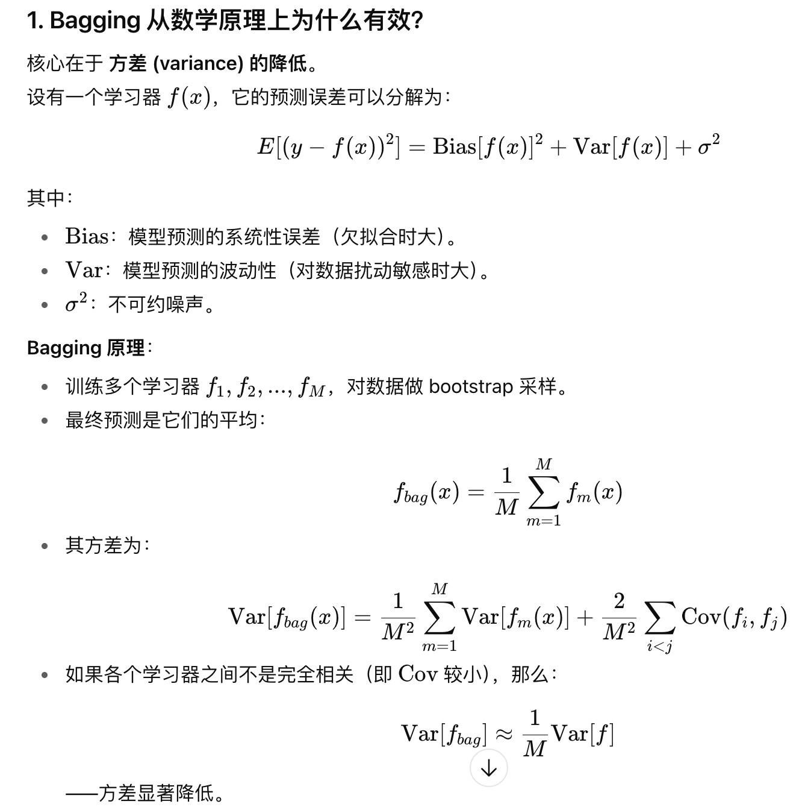
bagging不会显著降低bias，但会显著降低variance
降低 bias 的方法：提升模型复杂度、增加特征、用 boosting

### 13. 关于DataScience相关的知识梳理：假设检验(AB Test)、中心极限定理、一类/二类错误、绝对值/比值指标检验

1. 假设检验和AB test
推荐系统的AB测试：AB测试需要设置对照组和实验组，采用随机分桶的方式。n用户分成m个桶，每个桶有n/m个用户
随机分桶实现原理：
首先使用哈希函数将用户ID映射到某一个区间，然后把这些整数均匀分成m个桶
可以选取其中若干桶作为多个实验组采用不同的召回通道，再另取一个新桶为对照组使用原策略
计算每个桶的业务指标
如果某个实验组显著优于对照组则说明对应的策略有效值得推全。


Z检验：
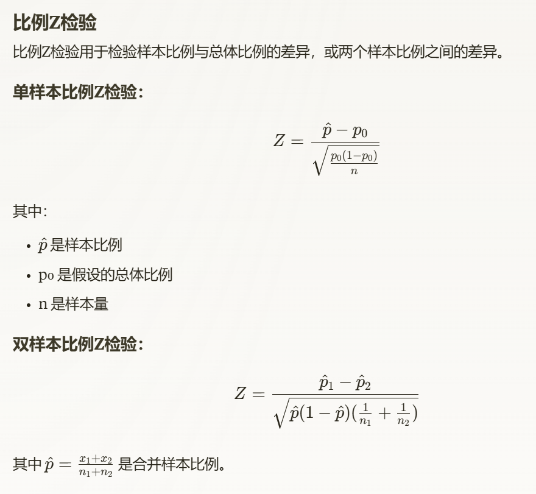
p 值（p-value，全称 probability value）是假设检验中的一个核心概念，它表示观察到当前数据（或更极端数据）的概率，假设原假设  为真。
p 值的大小决定了是否拒绝原假设
如果 p < 0.05，则拒绝原假设，认为有统计显著性。
如果 p ≥ 0.05，则不拒绝原假设，说明没有足够证据说明显著性差异。


AB测试中的常见问题与注意事项
- 样本量大小：样本量过小可能导致统计功效不足，即难以检测出实际存在的差异；样本量过大则可能导致微小差异也被认为是显著的。因此，在设计AB测试时，应合理计算所需样本量。

- 多重比较问题：如果同时进行多个AB测试，可能会增加假阳性结果的概率。可以使用Bonferroni校正等方法进行调整。

- 假设检验的误差类型：第一类错误（α错误）是指错误地拒绝了原假设；第二类错误（β错误）是指错误地接受了原假设。合理设定显著性水平和统计功效以平衡这两种错误。

- 时间维度的考虑：AB测试的结果可能会随着时间推移而发生变化，尤其是用户行为或外部环境发生改变时。因此，测试时间的选择应尽量避免干扰因素。


2. 中心极限定理
   的核心内容是：无论总体分布是什么样的，只要从中抽取的样本量足够大，样本均值的分布将逐渐趋近于正态分布。
   中心极限定理（CLT）的作用
定义：无论总体分布如何，样本均值（或比例）的抽样分布随样本量增大趋近于正态分布。
应用：
允许在小样本下使用t检验（若总体近似正态）。
允许在大样本下使用Z检验（即使总体分布非正态）。


3. xgboost与rf
   XGBoost在GBDT的基础上进行了很多优化，比如正则化项、二阶导数近似、特征分桶等等。XGBoost在GBDT基础上，引入正则化项和二阶泰勒展开，并优化树结构生成过程。
XGBoost 采用 梯度提升框架（Gradient Boosting Framework），每棵新树的构建是为了修正前一棵树的误差。目标函数：包括 损失函数（如均方误差、对数损失等）和 正则化项（防止过拟合）。
Random Forest（RF）随机森林属于Bagging，训练速度和预测速度都较慢，适用于小数据集、多样化特征。LightGBM（LGB）属于Boosting，适用于超大数据集。

LightGBM 继承了 梯度提升决策树（GBDT, Gradient Boosting Decision Tree） 的思想，但进行了 结构优化 和 算法加速，主要特点包括：
- 使用 Leaf-wise（叶子优先）策略，而非 XGBoost 的 Level-wise（层级优先）策略，使得分裂更加高效。
- 直方图优化（Histogram-based），降低内存占用，提高计算速度。（XGBoost是level-wise的直方图生成，LGB是leaf-wise的）
- 支持类别特征（Categorical Features），不需要独热编码（One-Hot Encoding）。
- 使用 GOSS（Gradient-based One-Side Sampling），对数据进行有针对性的采样，减少计算量。
- EFB（Exclusive Feature Bundling），将互斥的特征合并，减少特征维度。
  
4. DS和DA的理解
5. sql窗口函数以及区别
6. 绝对值指标和比值指标各自适用的检验
   绝对值指标适用z检验、t检验；比值指标适用卡方检验
7. 因果推断|常用方法
   - 随机实验 ab test 缺点：成本高昂
   - 双重差分 缺点：平行趋势假设
   - 匹配：完全匹配，最近邻匹配，卡钳匹配，全局最优匹配
   匹配的优点是可以直接利用协变量来进行匹配，而不需要建立倾向性得分模型。缺点是匹配方法可能存在维度灾难（Curse of Dimensionality）的问题，即当协变量数量较多时，很难找到完全匹配或近似匹配的个体，从而降低匹配质量和有效样本数量。
   -- 倾向性匹配（PSM）
   倾向性得分的优点是可以利用多个协变量来计算倾向性得分，而不需要进行多维度的匹配，从而减少匹配的复杂度和难度。缺点是倾向性得分也需要满足条件独立假设，而且可能存在倾向性得分模型设定错误、共同支持域外的观测值、匹配方法选择等问题，影响因果效应估计。
   -- 合成控制 
   利用多个未受到干预的单元（如国家、地区、企业等）的数据，通过线性加权的方式，构造一个虚拟的对照单元，来近似模拟受到干预的单元在没有干预时的情况，从而消除干预前后的差异，估计干预效应。合成控制方法利用多个协变量和结果变量来进行加权，要求满足条件独立假设和共同支持假设。
   -- Causal Impact
   基于贝叶斯结构时间序列模型（Bayesian Structural Time Series Model）的因果推断方法，它通过利用一个状态空间模型（State Space Model）来建模受到干预的单元（如时间序列）在没有干预时的情况，从而消除干预前后的差异，估计干预效应。Causal Impact方法利用多个协变量和结果变量来进行建模，要求满足条件独立假设和共同支持假设
8. 如何解决样本不均衡问题的方法
   我们通过解决样本不均衡，可以减少模型学习样本比例的先验信息，以获得能学习到辨别好坏本质特征的模型。AUC的含义是ROC曲线的面积，其数值的物理意义是：随机给定一正一负两个样本，将正样本预测分值大于负样本的概率大小。AUC对样本的正负样本比例情况是不敏感，即使正例与负例的比例发生了很大变化，ROC曲线面积也不会产生大的变化。
   可以将不均衡解决方法归结为：通过某种方法使得不同类别的样本对于模型学习中的Loss（或梯度）贡献是比较均衡的。具体可以从数据样本、模型算法、目标函数、评估指标等方面进行优化，其中数据增强、代价敏感学习及采样+集成学习是比较常用的，效果也是比较明显的。其实，不均衡问题解决也是结合实际再做方法选择、组合及调整，在验证中调优的过程。
9.  如何评判分类模型的好坏（混淆矩阵 F1 Score）
10. 数据预处理：异常值和重复值的处理
11. 特征选择
12. 处理多重共线性
    多重共线性（Multicollinearity）是指自变量（特征）之间存在高度线性相关性的现象。具体表现为：
一个自变量可以用其他自变量的线性组合近似表示。
   - 多重共线性的影响:
   模型稳定性下降、系数解释困难、模型性能下降、计算问题
   - 检测多重共线性的方法：
   - 相关系数矩阵：
   计算特征之间的皮尔逊相关系数，绝对值接近1表示强相关性。
   - 处理多重共线性的方法
   删除冗余特征、主成分分析（PCA）、增加数据量、特征工程（构造新特征（如比率、差值）替代原始特征）、正则化方法（岭回归（Ridge Regression）：
通过L2正则化约束回归系数；Lasso回归：通过L1正则化约束回归系数，同时进行特征选择）
13. 异动分析：广告主留存率下降或者用户数下降可能的原因
14. 一类错误与二类错误
    一类错误指的是在原假设/(𝐻0/)为真的情况下，错误地拒绝了它。也就是说，我们错误地认为有显著差异或效应，而实际上这种差异或效应不存在。
   一类错误的概率用𝛼表示，也称为显著性水平。通常我们设定𝛼=0.05或其他数值，这表示有 5% 的概率会犯一类错误。
   二类错误指的是在原假设为假的情况下，错误地接受（或不拒绝）了它。也就是说，我们漏掉了实际存在的效应或差异，未能发现假设中的“真”情况。
15. 机器学习分类与回归算法
    分类：
    - 逻辑回归（Logistic Regression）
      核心：通过Sigmoid函数将线性回归结果映射到[0,1]，输出概率。
      适用：二分类问题，特征与目标呈近似线性关系（如信用评分）。

    - 决策树（Decision Tree）
      核心：基于特征阈值递归划分数据，生成树形规则（如信息增益、基尼系数）。
      优势：可解释性强，支持非线性关系（如客户分群）。

   - 支持向量机（SVM）
      核心：寻找最大化类别间隔的超平面，核函数处理非线性可分数据（如文本分类）。
      特点：对高维数据有效，但需谨慎调参。
   - 随机森林（Random Forest）
      核心：多棵决策树的集成，通过投票减少过拟合（如图像分类）。
      优势：鲁棒性强，适合高维特征。
   - 神经网络（Neural Networks）
      核心：多层非线性变换建模复杂关系（如CNN用于图像，RNN用于文本）。
      适用：大数据量下的复杂模式学习。
   回归：
   线性回归（Linear Regression）
   核心：最小化预测值与真实值的平方误差，拟合线性关系（如广告投入与销量预测）。
   局限：假设线性，需处理多重共线性。

   决策树回归（Decision Tree Regressor）
   核心：划分特征空间为区域，区域内的平均值作为预测值（如用户行为预测）。
   问题：容易过拟合，需剪枝。

   梯度提升回归（Gradient Boosting）
   核心：迭代训练弱模型（如树），逐步修正残差（如Kaggle竞赛常用）。
   代表：XGBoost、LightGBM。

   贝叶斯回归（Bayesian Regression）
   核心：引入先验分布，输出预测的不确定性区间（如金融风险评估）。

## 传统机器学习 (ML)
### 14. HMM和CRF区别

**HMM** （Hidden Markov Model，隐式马尔可夫模型）
HMM是一种用于描述具有隐含状态的随机过程的统计模型。它假设当前状态仅依赖于上一个状态（马尔可夫性质），并通过观测值与状态之间的概率分布描述观测序列。
是一种生成式模型   假设隐藏状态之间满足马尔可夫性  固定特征   偏向简单的序列建模  计算复杂度较低
HMM求解过程可能是局部最优 CRF是全局最优

**CRF** Conditional Random Field 条件随机场
是一种判别式模型，用于建模输入序列和输出序列之间的条件概率。与 HMM 不同，它直接优化条件概率P(Y∣X)，而不关心数据生成过程。

给定输入序列\( X = \{x_1, x_2, \dots, x_T\} \)  和输出序列\( Y = \{y_1, y_2, \dots, y_T\} \), CRF的条件概率是：
$$P(Y \mid X) = \frac{1}{Z(X)} \exp \left( \sum_t \sum_k \lambda_k f_k(y_{t-1}, y_t, X, t) \right)$$
其中：
- \( f_k \) is the feature function,  是特征函数
- \( \lambda_k \) is the weight of the feature,  是特征的权重
- \( Z(X) \) is the normalization factor, ensuring the probabilities sum to 1. 归一化因子，确保概率和为1

### 15. PCA (降维)

PCA是一种降维方法，用数据里面最主要的方面来代替原始数据，例如将$m$个$n$维数据降维到$n'$维，希望这$m$个$n'$维数据尽可能地代表原数据。
⭐两个原则：最近重构性-->样本点到这个超平面的距离足够近；最大可分性-->样本点在这个超平面的投影尽可能的分开。
⭐流程：基于特征值分解协方差矩阵和基于奇异值分解SVD分解协方差矩阵。

（1）对所有样本进行中心化

（2）计算样本的协方差矩阵$XX^T$

（3）对协方差矩阵进行特征值分解

（4）取出最大的$n'$个特征值对应的特征向量，将所有特征向量标准化，组成特征向量矩阵W

（5）对样本集中的每一个样本$x^(i)$转化为新的样本$z^(i)=W^T x^(i)$，即将每个原数据样本投影到特征向量组成的空间上

（6）得到输出的样本集$z^(1)、z^(2)...$

⭐意义：a、使得结果容易理解 b、数据降维，降低算法计算开销 c、去除噪声

### 16. 如何改进kmeans (聚类)

kmeans的缺点：
1. k个初始化的质心对最后的聚类效果有很大影响
2. 对离群点和孤立点敏感
3. k值人为设定

改进：
1. Kmeans++： 从数据集随机选择一个点作为第一个聚类中心，对于数据集中每一个点计算和该中心的距离选择下一个聚类中心，优先选择和上一个聚类中心距离较大的点。重复上述过程得到k个聚类中心
2. K-medoids：计算质心时质心一定是某个样本值的点。距离度量：每个样本和所有其他样本的曼哈顿距离$D = |x_1 - x_2| + |y_1 - y_2|$
3. ISODATA，又称为迭代自组织数据分析法，是为了解决K值需要人为设定的问题。核心思想：当属于某个类别的样本数过少时或者类别之间靠得非常近就将该类别去除；当属于某个类别的样本数过多时，把这个类别分为两个子类别。

**和分类问题的区别**
分类的类别已知且需要监督，kmeans是聚类问题，类别未知不需要监督

**终止条件**
1. 相邻两轮迭代过程中非质心点所属簇发生改变的比例小于某个阈值
2. 所有簇的质心均未改变
3. 达到最大迭代次数

**时间复杂度**
$O(迭代次数 \ast 数据个数 \ast k \ast 数据维度)$，k为k个类别中心

**空间复杂度**
$O(数据个数 \ast 数据维度+k \ast 数据维度)$

### 17. L1正则化和L2正则化

用于减少过拟合，增强模型的泛化能力
L1：
$$J(\theta) = Loss + \lambda \sum_i |\theta_i|$$
L2:
$$J(\theta) = Loss + \lambda \sum_i \theta_i ^ 2$$
L2正则化不会让权重变为0，而是会让权重趋向于较小的值
对所有特征赋予了较小但非零的权重

L1适合高维稀疏数据
L2用于特征之间相关性较强的数据，当模型更注重稳定性而非稀疏性时首选

概率角度：L1 正则化相当于给权重𝑤施加 拉普拉斯分布，L2 正则化相当于给权重施加 高斯分布
拉普拉斯分布的概率密度在 0 附近陡峭，在远离 0 处衰减较慢，这意味着最优解倾向于让部分参数变为 0，从而产生稀疏性（sparsity）。由于 L1 正则化鼓励权重向 0 逼近，因此它通常用于特征选择（Feature Selection），最终可能导致部分特征的权重完全变为 0。
高斯分布在 0 附近较平缓，并且远离 0 处衰减迅速，这意味着 L2 正则化不会让权重直接变成 0，而是让其更接近 0。L2 正则化鼓励小的权重值，但不会完全去除某个特征，因此适用于防止过拟合，但不适用于特征选择。

图像角度：L1 正则化的约束形状是一个菱形 L2 正则化的约束形状是一个圆形

### 18. 总结如何解决过拟合

小数据集： 数据增强 + L2 正则化 + Dropout。
深度学习： Batch Normalization + Dropout + Early Stopping。
工业应用： 模型集成 + 数据扩充。

- L1 L2正则化
- Dropout: 随机丢弃一部分神经元及其连接，降低模型对某些特定神经元的依赖
- 提前停止 (Early Stopping):在验证集上监控模型性能，当验证集误差不再降低时停止训练，避免过度拟合训练集。
- Batch Normalization（BN） or Layer Normalization（LN）
- Weight Decay:在优化器中添加权重衰减参数，相当于对权重应用 L2 正则化。
- Learning Rate Scheduling:使用动态学习率（如逐步减小或余弦退火）防止模型陷入局部极小值。
- 增强数据利用：交叉验证、数据清洗
- 模型集成:通过集成方法（如 Bagging、Boosting、Stacking）结合多个弱模型，减少单一模型的过拟合风险。
- 数据扩充 (Data Augmentation)：图像：旋转、翻转、缩放、裁剪、颜色变化等。文本：同义词替换、句子重排、随机删除词语。音频：随机加噪、音调变化、时域拉伸。

### 19. 介绍几种聚类（k-means，混合高斯GMM，DBSCAN）

#### DBSCAN
基于密度的空间聚类算法，如果一个区域内的数据点密度超过某个阈值，就将这些点划分为一个聚类。密度相连的数据点构成聚类，处于低密度区域的数据点被称为噪声点。
算法流程：
1. 确定参数：确定邻域半径和最小样本点数m
2. 遍历数据点：对于数据集中的每个点，计算其邻域内的样本点数
3. 标记核心点、边界点和噪声点：如果一个点的邻域内样本点数大于等于m，则该点为核心点；如果一个点的邻域内样本点数小于m，但该点在某个核心点的邻域内，则该点为边界点；如果一个点既不是核心点也不是边界点，则为噪声点
4. 聚类扩展：从任意一个核心点开始，找到其密度可达的所有点，构成一个聚类。然后继续寻找未被聚类的核心点，重复上述过程，直到所有核心点都被处理完毕。
   
优点：
- 无需指定聚类数量
- 能发现任意形状的聚类：可以发现各种形状的聚类，而不仅仅是球形的聚类，能够处理具有不规则形状的数据分布，如环形、线性等形状的数据集合
- 对噪声点不敏感

缺点：
- 参数选择敏感
- 难以处理密度差异大的数据
- 计算复杂度较高
- 不适用于高维数据
  
#### 高斯混合模型（GMM）
基于概率模型的聚类方法，假设数据点是由多个高斯分布（正态分布）生成的，每个簇对应一个高斯分布。GMM使用期望最大化（EM）算法来估计每个簇的高斯分布参数。

GMM 的参数（均值 \( \mu \)、方差 \( \sigma^2 \)、权重 \( \pi \)）通过 EM 算法进行估计。EM 算法包括以下步骤：
(1) 初始化参数
- 随机初始化 \( \mu_k, \sigma_k^2, \pi_k \)；
- 或使用其他方法（如 K-Means 聚类的结果）初始化。

(2) E 步（Expectation, 期望步骤）
计算每个样本 \( x_i \) 属于每个高斯分布 \( k \) 的后验概率（责任度）：
\[
\gamma_{ik} = \frac{\pi_k \cdot \mathcal{N}(x_i|\mu_k, \sigma_k^2)}{\sum_{j=1}^K \pi_j \cdot \mathcal{N}(x_i|\mu_j, \sigma_j^2)}
\]

(3) M 步（Maximization, 最大化步骤）
根据责任度更新参数：

- **更新均值**：
\[
\mu_k = \frac{\sum_{i=1}^N \gamma_{ik} x_i}{\sum_{i=1}^N \gamma_{ik}}
\]

- **更新方差**：
\[
\sigma_k^2 = \frac{\sum_{i=1}^N \gamma_{ik} (x_i - \mu_k)^2}{\sum_{i=1}^N \gamma_{ik}}
\]

- **更新权重**：
\[
\pi_k = \frac{\sum_{i=1}^N \gamma_{ik}}{N}
\]

(4) 重复迭代
不断重复 E 步和 M 步，直到对数似然函数收敛：
\[
L = \sum_{i=1}^N \log \left(\sum_{k=1}^K \pi_k \cdot \mathcal{N}(x_i|\mu_k, \sigma_k^2)\right)
\]

#### Kmeans （爱考手撕）
通过最小化每个集群内的方差将数据分成k个集群
层次聚类：通过迭代合并或拆分现有组来构建集群层次结构

```
import numpy as np

def initialize_centroids(data, k):
    indices = np.random.choice(data.shape[0], k, replace = False)
    return data[indices]

def assign_clusters(data, centroids):
    distances = np.linalg.norm(data[:, np.newaxis] - centroids, axis = 2)
    return np.argmin(distances, axis=1)

def update_centroids(data, labels, k):
    new_centroids = np.array([data[labels == i].mean(axis = 0) for i in range(k)])
    return new_centroids

def kmeans(data, k, max_iters = 100, tol = 1e-4):
    centroids = initialize_centroids(data, k)
    
    for _ in range(max_iters):
        old_cantroids = centroids.copy()
        labels = assign_clusters(data, centroids)
        centroids = update_centroids(data, labels, k)
        if np.linalg.norm(centroids - old_cantroids) < tol:
            break
    return centroids, labels


if _name_=='_main_':
    data = np.random.rand(100, 2)
    k = 3
    centroids, labels = kmeans(data, k)
    print(centroids)
    print(labels)

```
   

### 20. 分类为什么不能用MSE

分类一般用交叉熵
MSE 计算的是数值误差，而不是概率之间的匹配程度。(回归任务用MSE)
同时，MSE 影响梯度下降，导致收敛缓慢
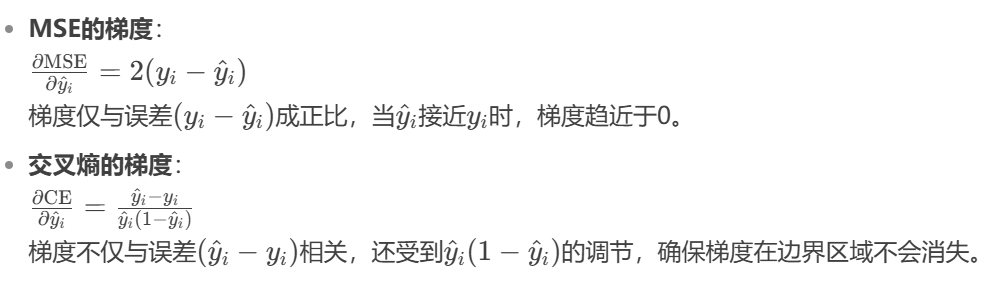

### 21. xgboost基本原理、RF与LGB对比、推导

XGBoost在GBDT的基础上进行了很多优化，比如正则化项、二阶导数近似、特征分桶等等。XGBoost在GBDT基础上，引入正则化项和二阶泰勒展开，并优化树结构生成过程。
XGBoost 采用 梯度提升框架（Gradient Boosting Framework），每棵新树的构建是为了修正前一棵树的误差。目标函数：包括 损失函数（如均方误差、对数损失等）和 正则化项（防止过拟合）。
Random Forest（RF）随机森林属于Bagging，训练速度和预测速度都较慢，适用于小数据集、多样化特征。LightGBM（LGB）属于Boosting，适用于超大数据集。

LightGBM 继承了 梯度提升决策树（GBDT, Gradient Boosting Decision Tree） 的思想，但进行了 结构优化 和 算法加速，主要特点包括：
- 使用 Leaf-wise（叶子优先）策略，而非 XGBoost 的 Level-wise（层级优先）策略，使得分裂更加高效。
- 直方图优化（Histogram-based），降低内存占用，提高计算速度。（XGBoost是level-wise的直方图生成，LGB是leaf-wise的）
- 支持类别特征（Categorical Features），不需要独热编码（One-Hot Encoding）。
- 使用 GOSS（Gradient-based One-Side Sampling），对数据进行有针对性的采样，减少计算量。
- EFB（Exclusive Feature Bundling），将互斥的特征合并，减少特征维度。

### 22. 数据不平衡常用的处理方法

1. 负采样优化：随机负采样、batch内负采样、按 popularity / 难度采样（hard negative）
场景题常考：随机负采样会天然偏向高活用户和热门物品，因为曝光日志本身是有偏的。工业界一般不会直接用纯随机采样，而是结合多种去偏手段：比如在用户维度限制每个用户的采样数量，防止高活用户主导训练；在物品维度按曝光频率的倒数采样，或者对 item 做 head / tail 分桶并定额采样，同时配合 loss reweighting 来校正分布变化。对于 hard negative，也会刻意引入一部分冷门 item，避免模型只学到热门偏好。
2. 模型层面：对正样本（点击、转化）赋予更高权重。Focal Loss 让模型关注难分类样本，对极度不平衡任务有效（CTR / CVR）
3. 建模策略：多目标模型
4. 同时预测：点击（CTR）、转化（CVR）或用 ESMM
5. 使用合适的评估指标
6. 线上分桶 & 流量校正

### 23. 如果一个模型在测试集上效果不好，如何改进？

从两个方面回答：欠拟合 过拟合
欠拟合：用更复杂的模型、增加特征数量、减少正则化、训练更长时间、用更好的优化算法
过拟合：增加训练数据、数据增强、使用正则化、减少模型复杂度、使用早停、降低学习率

### 24. TF-IDF

TF词频：
$$
TF(t, d) = \frac{\text{词 } t \text{ 在文档 } d \text{ 中出现的次数}}{\text{文档 } d \text{ 的总词数}}
$$

IDF逆文档频率：
$$
IDF(t) = \log \frac{N}{df(t) + 1}
$$

TF-IDF总公式：
$$
TF\text{-}IDF(t, d) = TF(t, d) \times IDF(t)
$$


### 25. 召回率，精确率，f1score，auc (基础指标)

精确率(Precision)
精确率衡量的是模型预测为正的样本中实际为正的比例：
Precision = TP / (TP + FP)
其中TP是真正例(True Positive)，FP是假正例(False Positive)。

召回率(Recall)
召回率衡量的是实际为正的样本中被模型正确预测的比例：
Recall = TP / (TP + FN)
其中FN是假负例(False Negative)
应用场景: 当漏检的代价高时很重要，例如疾病诊断（不想漏诊）

F1分数
F1分数是精确率和召回率的调和平均数：
F1 = 2 * (Precision * Recall) / (Precision + Recall)

AUC是ROC曲线下的面积，ROC曲线绘制了在不同阈值下的真正例率(TPR)和假正例率(FPR)：
TPR = TP / (TP + FN) = Recall
FPR = FP / (FP + TN)
AUC的含义是：随机选择一个正样本和一个负样本，模型正确将正样本排在负样本前面的概率。

### 26. 怎么做特征选择？

单特征分析：CTR / CVR 分桶计算：信息增益（IG）、卡方检验、KS / IV
检测特征共线性
模型驱动的特征选择：树模型、L1正则
Ablation：删特征看指标变化（常用）
特征门控 / Attention
正则化 & Dropout

### 27. 什么是模型的偏差，什么是方差？

偏差(Bias)是指模型预测值与真实值之间的系统性偏离。高偏差的模型往往对训练数据的拟合程度不足，这种情况也被称为欠拟合(underfitting)。
方差(Variance)是指模型对不同训练数据集的敏感程度，反映了模型预测的不稳定性。高方差的模型对训练数据中的随机波动非常敏感，会导致模型在训练数据上表现很好，但在新数据上表现差，这种情况被称为过拟合(overfitting)。

## 深度学习基础 (DL)
### 28. softmax如何防止指数上溢

softmax：
$$\text{softmax}(x_i) = \frac{e^{x_i}}{\sum_{j} e^{x_j}}$$
如何防止：
$$\text{softmax}(x_i) = \frac{e^{x_i - \max(x)}}{\sum_{j} e^{x_j - \max(x)}}$$

### 29. 训练过程中发现loss快速增大应该从哪些方面考虑？

1. lr学习率过大
2. 训练样本中有坏数据

### 30. Pytorch和Tensorflow的区别

Pytorch：
- 使用动态计算图（Dynamic Computational Graph）
  
TensorFlow：
- 传统上使用静态计算图（Static Computational Graph）；但 TensorFlow 2.x 引入了 Eager Execution（动态图特性），提升了易用性

### 31. DropOut 原理及实现

以p的概率使神经元失效，即使其激活函数输出值为0。Dropout 在训练时引入随机性，使得模型不能依赖某些特定神经元，从而提升模型的泛化能力。
为了使训练和测试阶段输出值期望相同，需要在训练时将输出值乘以1/（1-p）或者在测试时将权重值乘以（1-p）
Dropout只能放在Batch Norm之后使用。如果在 BatchNorm 前使用 Dropout，随机丢弃的神经元可能导致输入分布不稳定，影响 BatchNorm 的标准化效果。

### 32. 梯度消失和梯度爆炸

**梯度消失的原因和解决办法**
（1） 隐藏层的层数过多
反向传播求梯度时的链式求导法则，某部分梯度小于1，则多层连乘后出现梯度消失
（2）采用了不合适的激活函数
sigmoid函数的最大梯度为1/4，这意味着隐藏层每一层的梯度均小于1，出现梯度消失
解决办法： relu激活函数、权重L1 L2正则化  残差结构  batch norm

**梯度爆炸的原因和解决办法**
原因
深层网络结构
在非常深的网络中，反向传播时梯度通过多层连乘，可能会呈指数级增长。
不合适的权重初始化
如果初始权重设置得太大，经过多次乘积后梯度会迅速增大。
学习率过高
学习率设置过高，导致每次参数更新幅度太大，也容易引起梯度爆炸。
激活函数选择问题
某些激活函数（尤其是早期常用的 sigmoid 或 tanh）在某些区间内可能导致梯度饱和，从而在反向传播中出现不稳定现象（虽然这种情况也可能引发梯度消失，但在某些条件下也会伴随梯度爆炸）。
循环神经网络（RNN）中的长序列问题
在 RNN 中，由于每个时间步的梯度都要反向传播，多次连乘可能会导致梯度急剧放大。

解决办法
梯度裁剪（Gradient Clipping）
在反向传播时，对梯度进行上限截断，保证梯度不超过预定阈值，从而防止梯度爆炸。
降低学习率
适当降低学习率，减小每次参数更新的幅度，可以有效控制梯度的数值范围。
合适的权重初始化
采用诸如 Xavier（Glorot）初始化或 He 初始化的方法，确保初始权重不至于过大。
使用适当的激活函数
选择 ReLU 或其变种（如 Leaky ReLU）等激活函数，能减少梯度在反向传播过程中异常放大的可能。
残差连接（Residual Connections）
在深层网络中加入残差连接，可以缓解梯度传递中的指数放大问题。
归一化技术
使用 Batch Normalization、Layer Normalization 等归一化方法，稳定激活分布，有助于减缓梯度爆炸。
特殊网络结构
在处理长序列时，可以使用 LSTM、GRU 等设计上专门应对梯度爆炸问题的循环神经网络结构。

### 33. Batch/Layer/Instance/Group Normalization

### :pencil: Batch Normalization
对一个batch内的数据计算均值和方差，将数据归一化为均值为0、方差为1的正态分布数据，最后用对数据进行缩放和偏移来还原数据本身的分布

- Batch Norm 1d 输入是b*c, 输出是b*c，即在每个维度上进行normalization。
- Batch Norm 2d 例如输入是b*c*h*w，则计算normlization时是对每个通道，求bhw内的像素求均值和方差，输出是1*c*1*1。

BN测试时和训练时不同，测试时使用的是全局训练数据的滑动平均的均值和方差。
作用：a、防止过拟合 b、加速网络的收敛，internal covariate shift导致上层网络需要不断适应底层网络带来的分布变化 c、缓解梯度爆炸和梯度消失
局限：依赖于batch size，适用于batch size较大的情况

*一个batch内所有样本的某个channel做归一化

#### BN的作用
- BN通过将每一层网络的输入进行normalization，保证输入分布的均值与方差固定在一定范围内，减少了网络中的Internal Covariate Shift问题，并在一定程度上缓解了梯度消失，加速了模型收敛
- BN使得网络对参数、激活函数更加具有鲁棒性，降低了神经网络模型训练和调参的复杂度
- BN训练过程中由于使用mini-batch的mean/variance作为总体样本统计量估计，引入了随机噪声，在一定程度上对模型起到了正则化的效果
  

### :pencil: 改进
Layer normalization: 对每个样本的所有特征（所有channel）进行归一化，如N*C*H*W，对每个C*H*W进行归一化，得到N个均值和方差。
Instance normalization: 对每个样本的每个通道特征进行归一化，如N*C*H*W，对每个H*W进行归一化，得到N*C个均值和方差。
Group normalization：每个样本按通道分组进行归一化，如N*C*H*W，对每个C*H*W，在C维度上分成g组，则共有N*g个均值和方差。

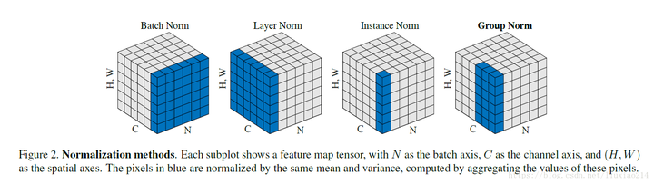

### BatchNorm训练和推理的区别
训练阶段对每个批次的数据计算均值和方差，然后对数据进行归一化操作
在推理阶段需要使用训练阶段统计得到的全局均值和方差来进行归一化操作

### 34. Optimizer (SGD, Adam, AdamW等)

### 什么是优化器？
优化器就是在深度学习反向传播过程中，指引损失函数（目标函数）的各个参数往正确的方向更新合适的大小，使得更新后的各个参数让损失函数（目标函数）值不断逼近全局最小。
典型的梯度下降算法

### 有哪些优化器？
1. 随机梯度下降算法（SGD）
   随机梯度下降算法每次从训练集中随机选择一个样本来进行学习
   
优点：

（1）每次只用一个样本更新模型参数，训练速度快

（2）随机梯度下降所带来的波动有利于优化的方向从当前的局部极小值点跳到另一个更好的局部极小值点，这样对于非凸函数，最终收敛于一个较好的局部极值点，甚至全局极值点。

缺点：

（1）当遇到局部最优点或鞍点时，梯度为0，无法继续更新参数
（2）沿陡峭方向震荡，而沿平缓维度进展缓慢，难以迅速收敛

2. SGDM （SGD with Momentum）
   
   为了抑制SGD的震荡，SGDM认为梯度下降过程可以加入惯性。下坡的时候，如果发现是陡坡，那就利用惯性跑的快一些。SGDM全称是SGD with momentum，在SGD基础上引入了一阶动量。一阶动量是各个时刻梯度方向的指数移动平均值，也就是说，t时刻的下降方向，不仅由当前点的梯度方向决定，而且由此前累积的下降方向决定。 β的经验值为0.9，这就意味着下降方向主要是此前累积的下降方向，并略微偏向当前时刻的下降方向。想象高速公路上汽车转弯，在高速向前的同时略微偏向，急转弯可是要出事的。

   因为加入了动量因素，SGD-M缓解了SGD在局部最优点梯度为0，无法持续更新的问题和振荡幅度过大的问题，但是并没有完全解决，当局部沟壑比较深，动量加持用完了，依然会困在局部最优里来回振荡。

3. NAG Nesterov Accelerated Gradient
4. AdaGrad（自适应学习率算法）
   SGD系列的都没有用到二阶动量。二阶动量的出现，才意味着“自适应学习率”优化算法时代的到来。SGD及其变种以同样的学习率更新每个参数，但深度神经网络往往包含大量的参数，这些参数并不是总会用得到（想想大规模的embedding）。对于经常更新的参数，我们已经积累了大量关于它的知识，不希望被单个样本影响太大，希望学习速率慢一些；对于偶尔更新的参数，我们了解的信息太少，希望能从每个偶然出现的样本身上多学一些，即学习速率大一些。

    怎么样去度量历史更新频率呢？

    那就是二阶动量——该维度上，记录到目前为止所有梯度值的平方和
    与SGD的区别在于，学习率除以 前t-1 迭代的梯度的平方和。故称为自适应梯度下降。

   Adagrad有个致命问题，就是没有考虑迭代衰减。极端情况，如果刚开始的梯度特别大，而后面的比较小，则学习率基本不会变化了，也就谈不上自适应学习率了。

5. Adam
   谈到这里，Adam和Nadam的出现就很自然而然了——它们是前述方法的集大成者。SGD-M在SGD基础上增加了一阶动量，AdaGrad和AdaDelta在SGD基础上增加了二阶动量。把一阶动量和二阶动量都用起来，就是Adam了——Adaptive + Momentum。
   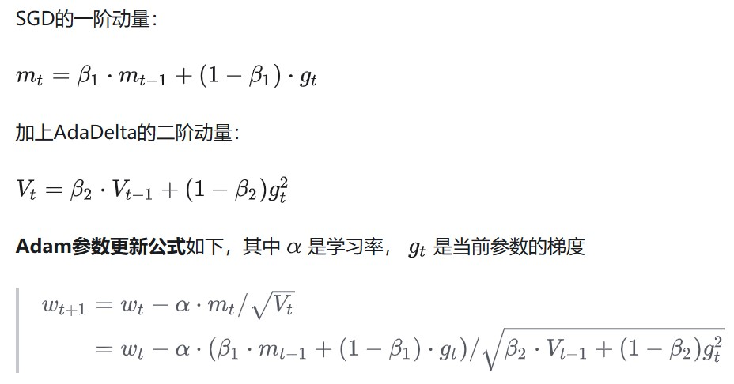
   优点：通过一阶动量和二阶动量，有效控制学习率步长和梯度方向，防止梯度的振荡和在鞍点的静止。
   缺点：1. 可能不收敛  2. 可能错过全局最优解

6. AdamW
   提出的动机：原先Adam的实现中如果采用了L2权重衰减，则相应的权重衰减项会被直接加在loss里，从而导致动量的一阶与二阶滑动平均均考虑了该权重衰减项（图1. 式6），而这影响了Adam的优化效果，而将权重衰减与梯度的计算进行解耦能够显著提升Adam的效果。目前，AdamW现在已经成为transformer训练中的默认优化器了
   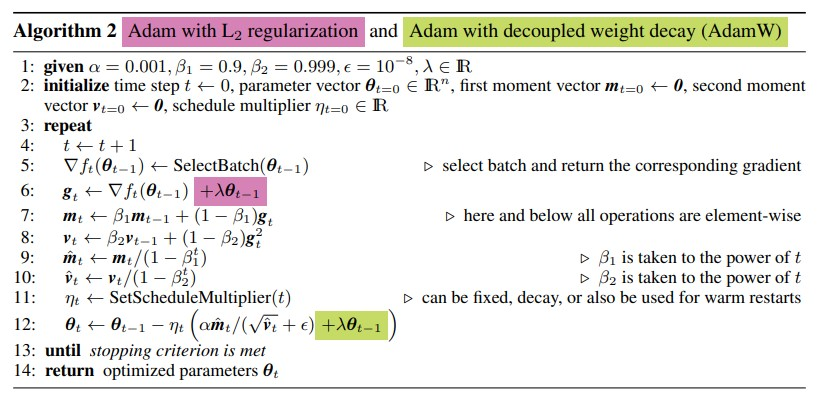

### 35. sigmoid 实现

```
import numpy as np

def sigmoid(x):
   return 1.0/(1+np.exp(-x))
```

### 36. ReLU为什么能缓解梯度消失

ReLU的定义是 f(x) = max(0,x), 当输入x>0时，ReLU的导数为1， 意味着梯度不会消失，可以有效地将梯度信号从输出层向前传递到较浅的层。相比sigmoid或tanh激活函数，后者在输入较大或较小时会进入饱和区间，导数趋近于0，导致梯度消失。ReLU没有上界且对正值输入没有非线性变换，避免了梯度的快速衰减。

### 37. 卷积神经网络

卷积层 → 激活层 → 池化层
这个顺序的理论基础是：
卷积层首先提取空间特征  ReLU LeakyReLU
激活层引入非线性，增强网络表达能力
池化层降低特征图尺寸，提取主要特征并降低计算复杂度
全连接层之后接ReLU或者Softmax Sigmoid

#### 卷积层计算公式速查表

**符号定义：**
* **输入尺寸**：$(H_{in}, W_{in}, C_{in})$
* **卷积核大小**：$(K, K)$
* **输出通道数**：$C_{out}$
* **步长**：$S$
* **填充**：$P$

| 指标 | 计算公式 | 备注 |
| :--- | :--- | :--- |
| **输出高度** $H_{out}$ | $\lfloor \frac{H_{in} - K + 2P}{S} \rfloor + 1$ | 宽度同理，$\lfloor \cdot \rfloor$ 表示向下取整 |
| **参数量** (Params) | $(K \times K \times C_{in} + 1) \times C_{out}$ | 括号内为单个核参数，`+1` 表示 Bias (偏置) |
| **计算量** (FLOPs) | $H_{out} \times W_{out} \times K \times K \times C_{in} \times C_{out}$ | 也可以理解为：**输出特征图体积 $\times$ 卷积核面积 $\times$ 输入通道** |


### 38. 分类和回归任务中常用的loss

| 任务   | 常用 Loss |
|------|-----------|
| 二分类 | Binary Cross-Entropy |
| 多分类 | Categorical Cross-Entropy |
| 不平衡 | Focal Loss / Weighted Cross-Entropy |
| 回归   | MSE / MAE / Huber |
| 排序   | RankNet / LambdaRank |
| 推荐   | BPR / Softmax Loss |

- Binary Cross-Entropy： L = - [ y * log(p) + (1 - y) * log(1 - p) ]
- Categorical Cross-Entropy：L = - Σ ( y_i * log(p_i) )
- Weighted Cross-Entropy： L = - [ w1 * y * log(p) + w0 * (1 - y) * log(1 - p) ]
- Focal Loss： L = - (1 - p)^γ * y * log(p)
- MSE（Mean Squared Error）：L = (1 / n) * Σ (y - ŷ)^2
- MAE（Mean Absolute Error）：L = (1 / n) * Σ |y - ŷ|
- Huber Loss：L = 0.5 * (y - ŷ)^2                  if |y - ŷ| <= δ
L = δ * |y - ŷ| - 0.5 * δ^2          otherwise
- RankNet Loss（Pairwise）：L = - [ y * log(σ(s_i - s_j)) + (1 - y) * log(1 - σ(s_i - s_j)) ]
- LambdaRank： L ∝ ΔNDCG * (1 / (1 + exp(s_i - s_j)))
- BPR Loss：L = - log( σ(s_u_pos - s_u_neg) )
- Softmax Loss：L = - log( exp(s_pos) / Σ exp(s_j) )


### 39. sigmoid和relu的区别

Sigmoid 更适合用于需要概率输出的场景（如二分类的输出层），但在深度网络中由于梯度消失问题，不常用作隐藏层的激活函数。
ReLU 则因其计算简单、训练效率高且能够缓解梯度消失问题，成为现代深度神经网络中隐藏层激活函数的首选，但也需要注意“神经元死亡”的可能性，可通过使用 Leaky ReLU 等变种加以改善。


# LLM (大模型) 与 NLP 相关知识
## 1. NLP 与 Transformer 基础架构
### 40. Word2Vec (CBOW, Skip-Gram)
Word2Vec 是一种将单词映射为向量表示的技术，基于分布式表示学习的思想。它的核心原理是利用单词在文本中的上下文关系，学习到每个单词的低维向量表示（embedding），以捕捉语义信息。Word2Vec 的训练方法主要有两种：CBOW（Continuous Bag of Words） 和 Skip-Gram.

1. CBOW（Continuous Bag of Words）
   通过上下文预测中心词
2. Skip-Gram
   通过中心词预测上下文

### 41. transformer 整体时间复杂度

Transformer 的整体时间复杂度主要由 自注意力（Self-Attention） 和 前馈网络（Feed-Forward Network, FFN） 这两个核心部分决定。
最后是：$$O(L(N^2 d + N d^2))$$

### 42. 注意力怎么计算（维度）
输入张量维度：
```
batch size = B
sequence length = L
model hidden size = d_model
```
即
```
X : (B, L, d_model)
```
权重矩阵：
```
W_Q : (d_model, d_k)
W_K : (d_model, d_k)
W_V : (d_model, d_v)
```
d_k = d_v = d_model / h
则：
```
Q = X @ W_Q  → (B, L, d_k)
K = X @ W_K  → (B, L, d_k)
V = X @ W_V  → (B, L, d_v)
```
Attention = Q @ K^T
```
Q      : (B, L, d_k)
K^T    : (B, d_k, L)
Score  : (B, L, L)
```
Scale + Softmax:
```
Attention_Weight = softmax( Score / sqrt(d_k) )
# (B, L, L)
```
加权求和 Value：
```
Output = Attention_Weight @ V
# (B, L, L) @ (B, L, d_v) → (B, L, d_v)
```

### 43. multihead attention 和attention的区别？

单头注意力计算时通过一个查询、键和值的映射来进行注意力计算；而 多头注意力 则是通过多个查询、键和值的不同映射（多个头）并行计算，并将结果合并。
多头注意力 能够捕捉到输入的不同子空间信息，使模型在处理信息时更加多样和全面。
性能：多头注意力相较于单头注意力通常能取得更好的效果，尤其是在复杂任务和大规模模型中，能够从多个不同的角度学习信息，避免单一头带来的限制。

### 44. transformer的变体 (Encoder/Decoder-only等)

Encoder-only 模型：
如 BERT、RoBERTa，主要用于语言理解任务（分类、序列标注、检索等）。

Decoder-only 模型：
如 GPT 系列，主要用于生成任务（文本生成、对话生成、代码生成等）。

Encoder-Decoder 模型：
如原始 Transformer、T5、BART，主要用于序列到序列任务（机器翻译、摘要生成、问答等）。

改进注意力机制的变体：

Transformer-XL： 引入相对位置编码和长程依赖机制；
Reformer： 利用局部敏感哈希（LSH）注意力减少内存和计算；
Linformer、Performer： 分别通过低秩分解或核近似方法实现高效注意力；
Longformer、BigBird： 针对长文本设计稀疏注意力机制；
Sparse Transformer： 利用稀疏模式降低计算量。

### 45. decoder处的k，v矩阵来自哪里？
| Attention 类型                                   | Q 来自       | K / V 来自              |
| ---------------------------------------------- | ---------- | --------------------- |
| **Masked Self-Attention**                      | Decoder 自己 | **Decoder 自己（已生成部分）** |
| **Cross-Attention（Encoder–Decoder Attention）** | Decoder    | **Encoder 的输出**       |

### 46. MHA的几种变体 
标准MHA：
```
head_i = Attention(QW_i^Q, KW_i^K, VW_i^V)
MHA = Concat(head_1, ..., head_h) W^O
```
self-attention:
```
Q = K = V = X
```
Cross-Attention:
```
Q 来自 decoder
K, V 来自 encoder
```
Masked Multi-Head Attention:
```
Attention(Q, K, V + mask)
```
MQA: 多个 Q 头,共享 K 和 V,显存大幅下降, 推理速度显著提升,KV cache 减少
GQA: Q 分成 g 组, 每组共享一套 K, V, 相当于一种折中做法
MLA：Deepseek提出的，并不直接减少K，V的数量，而是把KV压缩成低秩的向量表示


### 47. LLama在模型的decoder层面做了哪些改进？

LLaMA 在 decoder 层并未改变 Transformer 的核心结构，而是在注意力与前馈层的具体实现上做了工程化与训练稳定性导向的改进：采用 RMSNorm 替代 LayerNorm、使用 SwiGLU 前馈结构、引入 RoPE 旋转位置编码并仅作用于 Q/K、预归一化（Pre-Norm）残差结构，以及更高效的 KV 设计与超参数配置，从而在保持标准 decoder-only 架构的同时显著提升训练效率、稳定性和长上下文建模能力。

### 48. Attention与全连接层的区别

注意力机制可以利用输入的特征信息来确定哪些部分更重要
MLP只关注模式匹配，并不关注数据特征
注意力机制的意义是引入了权重函数f，使得权重与输入相关，从而避免了全连接层中权重固定的问题

### 49. 为什么Pre-LN比Post-LN稳定？

#### Post-LN（最早的 Transformer）

公式：
\[
x_{l+1} = LN(x_l + F(x_l))
\]

特点：
- 残差连接和子层输出都要经过 LN。
- 残差的“恒等映射”被 LN 打破了。
- 深层时梯度可能被 LN 缩放，导致 **梯度消失/爆炸**。

#### Pre-LN（后来的改进版）

公式：
\[
x_{l+1} = x_l + F(LN(x_l))
\]

特点：
- 先 LN 再送进子层，残差是干净的 **identity mapping**。
- 梯度可以直接绕过子层，稳定传播。
- 深层训练时收敛更快、更稳定。

所以几乎所有现代 Transformer（GPT, BERT 的变体等）都用 **Pre-LN**。


### 50. 正弦位置编码和RoPE的区别？

传统正弦位置编码是将绝对位置信息以加法形式注入到 token embedding 中，而 RoPE（旋转位置编码）是通过对注意力中的 Q、K 向量做位置相关的旋转，将位置信息隐式地编码进内积计算中；前者建模的是绝对位置，外推能力较弱，后者天然建模相对位置关系，更适合长上下文和长度外推。

## 2. LLM 训练、微调与推理
### 51. Pre-Training, SFT, LoRA, RLHF 之间的关系 (综述)

#### Pre-Training
   对模型进行**初步训练**，预训练的模型通常是一个通用的模型
   节约数据和计算资源效率，更快的收敛和泛化能力   （收集大量无标注的通用数据进行数据清洗和预处理）
   使用高效分布式训练技术在大规模数据集上进行训练，优化器通常使用Adam或其变种，学习率调度使用warm-up和decay策略

#### Fine-Tuning
   在预训练完成之后对模型进行特定任务的调整的过程
   主要目标： 最小化目标任务的损失函数，通常为监督学习任务，如分类或回归

**分类任务**

   目标是将输入正确地分类到某个类别中，通常使用 **交叉熵损失函数** (Cross-Entropy Loss) 作为目标函数：
\[
\mathcal{L}_{\text{classification}} = - \frac{1}{N} \sum_{i=1}^{N} \sum_{j=1}^{C} y_{i,j} \log(\hat{y}_{i,j})
\]

- \( N \): 样本数量  
- \( C \): 类别数量  
- \( y_{i,j} \): 样本 \( i \) 的真实标签（one-hot 编码，值为 \( 0 \) 或 \( 1 \)）  
- \( \hat{y}_{i,j} \): 样本 \( i \) 的第 \( j \) 类的预测概率（通过 softmax 输出）  

对于二分类任务，可以进一步简化为 **Binary Cross-Entropy**：
\[
\mathcal{L}_{\text{binary}} = - \frac{1}{N} \sum_{i=1}^{N} \left[ y_i \log(\hat{y}_i) + (1 - y_i) \log(1 - \hat{y}_i) \right]
\]

**回归任务**

目标是预测连续数值，通常使用 **均方误差损失函数** (Mean Squared Error, MSE) 或 **平均绝对误差损失函数** (Mean Absolute Error, MAE)。

(1) 均方误差 (MSE)：
\[
\mathcal{L}_{\text{regression\_MSE}} = \frac{1}{N} \sum_{i=1}^{N} \left( y_i - \hat{y}_i \right)^2
\]

(2) 平均绝对误差 (MAE)：
\[
\mathcal{L}_{\text{regression\_MAE}} = \frac{1}{N} \sum_{i=1}^{N} \left| y_i - \hat{y}_i \right|
\]

- \( N \): 样本数量  
- \( y_i \): 样本 \( i \) 的真实值  
- \( \hat{y}_i \): 样本 \( i \) 的预测值  

部分层可能会被冻结，部分层会被解冻以更新参数。冻结层的参数保持不变，解冻层则会参与梯度更新

为什么要进行fine-tuning：
- 解决特定任务需求
- 小数据集优化
- 降低训练成本
- 增强迁移能力
  
fine-tuning的流程：
1. 准备任务数据：收集并清洗任务相关的标注数据，格式化数据，确保符合输入需求
2. 加载预训练模型：使用开源的预训练模型，加载基础模型的权重作为初始化参数
3. 定义任务特定的架构，例如文本分类任务：预训练顶部加一个全连接层  文本生成任务：调整解码头  图像任务：添加特定分类头或调整输出层
4. 冻结部分参数（可选）：对于数据量较少的场景可以冻结预训练模型的大部分参数，只微调顶部层的权重，以避免过拟合
5. 设置优化器和学习率：使用优化器（如AdamW），调整学习率，学习率调度策略：warmup和decay
6. 训练模型
7. 验证与评估
8. 保存与部署

FineTuning分为全参微调和高效微调（例如LoRA）

#### SFT
SFT用于明确指导模型调整权重，在监督数据（带有输入和目标输出的标注数据）上微调一个预训练的模型。目的是让模型在特定的、有监督任务（如分类、生成）中表现更好。Fine-Tuning更广义，包括有监督和无监督场景。
为RLHF打下基础

#### LoRA
LoRA 的想法是：我们不直接改原模型的参数，而是在模型的某些关键层（比如线性变换层）旁边加一个“低秩调整模块”，让它去学习新任务的特征。
W‘ = W + ΔW    ΔW = AB
#### RLHF
利用人类提供的反馈数据指导模型优化，生成更符合预期的响应

- 改进输出质量
- 引入主观偏好
- 减少负面行为

 RLHF流程
1. pretrain
   语言模型在大规模无监督数据上进行预训练，学习自然语言的语法、语义以及基本推理能力。
预训练的目标为最大化语言模型的对数似然：
$$\mathcal{L}{\text{pretrain}} = \sum{i=1}^N \log P_{\theta}(y_i|y_{<i})$$
其中：
- $y_i$ 是目标序列中的第i个token
- $P_{\theta}(y_i|y_{<i})$ 是给定前序token时预测 $y_i$ 的条件概率
2. 人类反馈模型训练
   目标：训练一个奖励模型（Reward Model, RM），通过人类反馈对生成的文本进行打分，作为强化学习的奖励信号。
流程：

人类评估员会对模型生成的多种响应进行排序，例如从最优到最差
使用这些排序数据训练奖励模型，使其学会预测文本的优劣
奖励模型的损失函数为：

$$\mathcal{L}{\text{RM}} = -\mathbb{E}{(x,y_w,y)∼\mathcal{D}}[\log σ(R_φ(x,y_w) - R_φ(x,y))]$$
其中：
- $x$ 是输入
- $y_w$, $y$ 分别是人类评估中被认为较优和较差的输出
- $R_φ(x,y)$ 是奖励模型对 $(x,y)$ 的评分
- $σ$ 是sigmoid函数
  
3. 强化学习优化语言模型
  目标：使用强化学习基于奖励模型优化语言模型，使其生成更符合人类偏好的文本。
策略优化：使用策略优化算法调整模型参数。
奖励信号：

奖励信号来自训练好的奖励模型 $R_φ(x,y)$，表示生成文本的质量
强化学习的目标是最大化预期奖励：$\mathcal{L}{\text{RL}} = \mathbb{E}{y∼P_θ}[R_φ(x,y) - β · D_{\text{KL}}(P_θ||P_{\text{pretrained}})]$ 

### 52. Transformer训练的时候主要是什么数据在使用显存？

- 模型参数：模型的权重和偏置
- 中间激活值占用的显存：注意力计算的中间结果：Q、K、V矩阵及其变换，注意力分数矩阵，前馈网络的中间激活值，每一层的输出
-  优化器状态占用的显存：比如使用Adam优化器，它需要为每个参数保存：一阶动量  二阶动量
-  梯度累积和同步占用的显存：反向传播过程中计算得到的梯度，用于更新模型参数
-  输入数据：训练数据也需要加载到显存中，以便于模型进行前向传播计算

### 53. 监督微调sft和继续预训练cpt有什么差别？

数据：SFT需要有标注的数据，数据量较小，因为获得已标注的高质量数据集通常比较困难且成本较高；CPT主要使用无标注的数据，数据量较大，可以帮助模型进一步学习语言的统计规律、语义知识等。
目标：SFT想让预训练的模型更好地适应特定任务或特定数据集，CPT让模型进一步提升通用语言能力
SFT监督学习，训练周期短，CPT自监督学习，训练周期长

### 54. transformer中对梯度消失或者梯度爆炸的处理 

1. 归一化（Normalization）
   Transformer 采用 Layer Normalization（层归一化） 代替 Batch Normalization，因为：
   - BatchNorm 依赖 batch 统计量，而 Transformer 常用于 NLP（变长序列），批次统计不稳定。
   - LN 计算的是每个 token 维度上的均值和方差，不受 batch size 影响。
  $$
\text{LN}(x) = \frac{x - \mu}{\sigma + \epsilon} \cdot \gamma + \beta
$$
  PyTorch 默认 𝜖=1𝑒−5

2. 残差连接（Residual Connection）
   每个 Transformer 子层都使用 残差连接（Skip Connection），即：
   $$Output=LN(SubLayer(x)+x)$$
   其中 𝑥是输入，SubLayer(x) 是 Transformer 的子层（如 Multi-Head Attention 或 FFN）。
3. 适应性优化器（Adam + 学习率调度）
   Transformer 训练一般使用 AdamW（带权重衰减的 Adam），并结合 学习率调度（Learning Rate Warmup + Decay）
   Adam 会对梯度进行自适应缩放，不同参数的学习率不同 但 L2 正则化假设所有参数的学习率一致 结果：L2 正则化项在 Adam 里会被错误缩放，影响优化效果
   AdamW 解决了 Adam 与 L2 正则化不兼容的问题：独立权重衰减
4. 混合精度训练（Mixed Precision Training）
   使用 FP16（半精度浮点） 训练 Transformer，可减少显存占用，并稳定梯度：
   - 计算 前向传播时使用 FP16
   - 反向传播时用 FP32 以保持稳定性
 - autocast：自动混合精度计算
 - GradScaler：梯度缩放，防止梯度下溢
5. 预训练 + 微调（Pretraining & Fine-tuning）
6. 梯度裁剪（Gradient Clipping）

### 55. 如何计算训练一个模型所需的显存？

训练显存主要由四部分组成：模型参数、梯度、优化器状态和前向激活。
在 FP16 + Adam 的情况下，参数、梯度和优化器状态大约是参数大小的 6 倍；
激活显存与 batch size、sequence length、层数和 hidden size 成正比，通常是显存的主要增长项。
因此训练一个模型的总显存 ≈ 6 × 参数显存 + 激活显存 + 少量 buffer，工程上通常通过 混合精度、gradient checkpoint 和 ZeRO 来降低显存占用。

为什么是6倍？：
每个参数需要存：

| 内容                 | 份数 | 说明       |
| ------------------ | -- | -------- |
| 模型参数               | 1× | 权重本身     |
| 梯度                 | 1× | 反向传播需要   |
| Adam 一阶动量 (m)      | 1× | momentum |
| Adam 二阶动量 (v)      | 1× | RMS      |
| FP32 master weight | 2× | 数值稳定性    |

推理和训练为什么差这么多：
训练要为反向传播“存信息”，推理不需要。
推理不需要：梯度、优化器状态、反向计算，只保 KV cache（自回归生成）


### 56. 全参微调和lora微调的区别，全参微调会出现什么问题？怎么解决灾难性遗忘问题
全参微调（Full-parameter fine-tuning）：
对预训练模型的所有参数进行更新。优点是模型可以充分适应下游任务，但缺点也很明显：

计算与存储开销大：大模型参数量庞大，微调时需要存储和更新所有参数。
灾难性遗忘（Catastrophic Forgetting）：在适应新任务时，模型可能会遗忘预训练时学到的通用知识，导致下游任务效果不稳定，尤其在数据量较少的情况下更为明显。
LoRA 微调：
LoRA（Low-Rank Adaptation）是一种参数高效微调方法，其思路是：

保持预训练模型参数冻结，仅在每个层中插入低秩矩阵（即增加少量可训练参数），用于调整模型输出。
优点是参数量显著减少、训练更快、存储更高效，同时能较好地保留预训练知识，从而减轻灾难性遗忘。
如何解决灾难性遗忘问题：

正则化方法： 如权重衰减、L2 正则化以及知识蒸馏（让新模型的输出与预训练模型保持一致）等。
冻结部分层参数： 例如冻结预训练模型的低层，仅微调高层或加入适配器（Adapter）。
使用 LoRA、Adapter、Prefix-tuning 等方法： 这些方法只更新少量额外参数，降低对预训练权重的扰动，从而有效缓解灾难性遗忘问题。

### 57. SFT有哪些训练方式？

SFT（Supervised Fine-Tuning）本质是在有监督数据上做条件语言建模，SFT 最常见的是基于 teacher forcing 的条件语言建模，实际训练中通常只对 response 部分计算 loss；在参数更新上可以是全参数微调或 LoRA 等参数高效方式；在数据组织上可以支持多轮对话、多任务混合和课程学习，工业界主流是 masked SFT + LoRA。

- 标准 SFT（Teacher Forcing）

输入：(prompt, response)
训练目标：最大化 response 的条件概率：
$$
\mathcal{L} = - \sum_{t} \log P\left(y_t \mid x, y_{<t}\right)
$$

- Masked SFT（只算答案 loss）

prompt 部分 mask 掉 loss，只对 response 计算 loss。大多数 LLM SFT 实际都会做 loss mask

- 按参数更新范围划分

全参数 SFT（Full Fine-tuning）：更新所有模型参数

参数高效 SFT（PEFT）：常见方式：LoRA、Prefix / Prompt Tuning、Adapter, 冻结 backbone只训练少量参数,多任务友好

- 按训练策略划分：

Curriculum SFT（课程学习）简单 → 复杂 短 → 长 高质量 → 广覆盖 用于提升收敛稳定性

Continual / Incremental SFT： 分阶段不断加新数据，防止灾难性遗忘，用于新功能上线

### 58. GRPO DPO

GRPO通过优化PPO算法，移除了价值模型，降低了计算开销，同时利用群体相对优势函数和KL散度惩罚，确保策略更新既高效又稳定
GRPO与PPO的区别：1）PPO用critic model拟合base（期望）， GRPO用采样simulate出base    2）PPO的action是solution-level的，而GRPO的action是token-level的


DPO：
DPO训练目标：
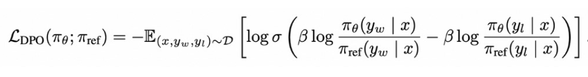
DPO推导：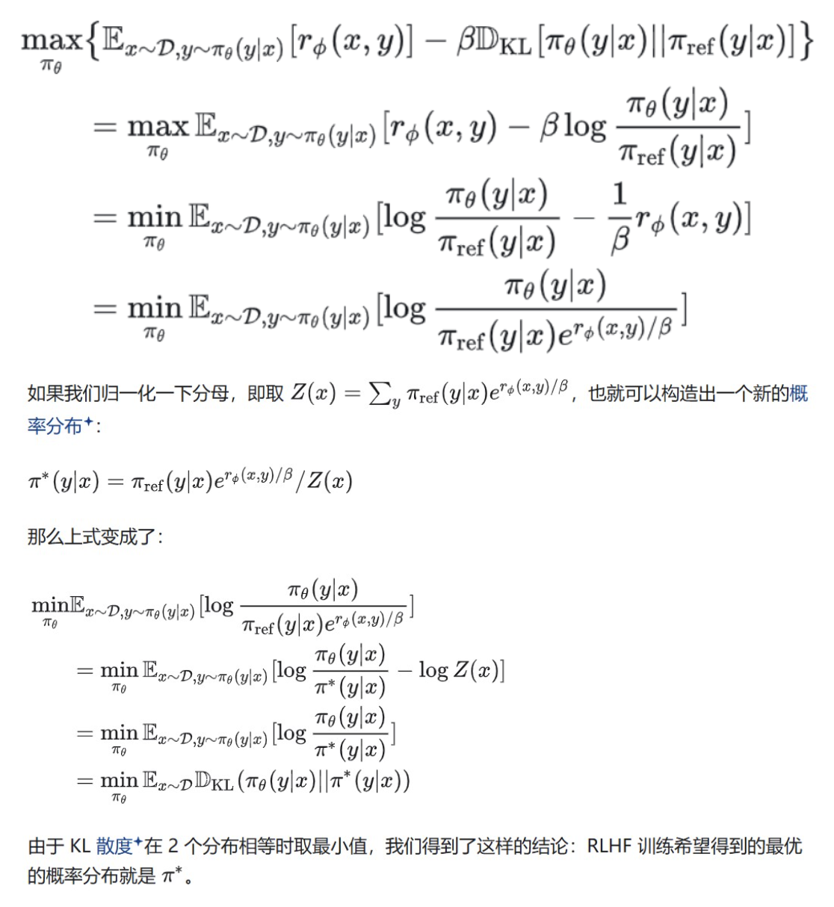 

**关于online DPO：**
区分 online / offline 最关键的在于 preference signal 采集的模式不同。
DPO 直接在给定的数据集上进行偏好学习: offline
我们从一个给定的数据集训练得到一个奖励函数, 并使用PPO优化这个奖励函数: offline
我们从一个给定的数据集训练得到一个奖励函数, 并使用rejection sampling finetuning 优化: offline
DPO 是 off-policy的：使用某个行为策略采集数据，但是用以改进另一个策略的算法。

online的一个比较重要的点是online data的采集。首先要有足够好的 offline dataset 来提供这个初始的覆盖条件：
$$
\pi_t^2(\cdot | x) = \arg \max \| \phi(x, \pi_t) - \phi(x, \pi_t^2) \|_{\Sigma_{t,m}^{-1}}
$$

公式中的$𝜋_𝑡$ (第一个策略)：是基于已有的历史数据训练得到的策略。这可以通过方法如 DPO 或 RLHF 实现。利用已有数据生成当前阶段的 最佳猜测策略（best guess policy）。这是历史数据指导下的一个保守选择，主要目标是最大化对已知数据的利用。

第二个策略 (\(\pi_t^2\))：第二个策略选择的是在特征表示空间中，与第一个策略的特征差异最大化的方向：通过扩大与第一个策略的特征差异，寻找数据分布中尚未被充分探索的区域。 哪个区域没被探索就加强探索！所以我们要保证与策略1的**difference比较大**，这样能带来比较好的diversity 与 探索。


### 59. KV Cache (推理加速)

KV Cache（Key-Value Cache）在 Transformer 架构中的推理阶段扮演着关键角色，它能够加速自回归（auto-regressive）文本生成任务，例如 GPT 系列模型、LLama 以及 vLLM 等都利用了 KV Cache 来提高生成速度和降低计算成本。

在 Transformer 生成过程中，每个 token 都依赖于之前生成的 token 来计算当前 token 的输出。这意味着，对于每一个新的 token，模型都需要重新计算之前所有 token 的 Key 和 Value（K/V）并将其输入到注意力机制中。

但在推理（inference）阶段，输入序列是固定的，每一步生成时，前面已经计算过的 K/V 值可以缓存起来，避免重复计算。这就是 KV Cache 的作用，它缓存了先前步骤的 K 和 V，使得新 token 生成时只需要计算当前 token 的 K/V，然后与缓存进行拼接，大幅减少计算量。计算量从O(n^2) --> O(n)
Transformers默认实现：use_cache=True
vLLM 对 KV Cache 进行了 显存优化 和 高效管理：
vLLM 提供：
1. 连续内存优化（PagedAttention）：
   采用 分块存储（chunk-based KV Cache），可以动态分配显存，避免浪费。逻辑块表示序列在概念上的连续存储单元，而物理块则是实际的内存存储单元。一个序列的逻辑块可以映射到非连续的物理块，这意味着序列的数据在物理内存中不必是连续的。这种映射关系通过块表（Block Table）进行维护。
   解决了传统缓存方法的 显存碎片化 问题。
2. 并行管理多个生成任务：
vLLM 可以同时管理多个 KV Cache，实现 多请求高效处理。

### 60. AI Safety

LLM jailbreaking (待补充)

### 61. chatgpt性能提升的主要原因是什么？

架构改进 decoder-only
引入RLHF （PPO微调模型
大规模数据训练
指令调优、上下文学习

### 62. 大模型训练中的OOM问题有哪些解决办法？

- 减少单卡显存：混合精度训练（FP16 / BF16）、减小 batch size / sequence length、Gradient Checkpointing、使用更省显存的优化器 Adam → AdamW / 8-bit Adam / SGD
- 分摊显存：ZeRO（DeepSpeed）、模型并行 / 张量并行 / Pipeline 并行
- 工程：FlashAttention、PEFT/loRA

# 推荐系统相关知识 (RecSys)
## 推荐系统基础与业务

建议看王树森推荐系统基础，下面的问题只是面试易考题不能作为学习基础知识的资料

### 63. 行为序列建模 (LastN)

LastN 行为序列建模是指只使用用户最近的 N 次行为作为输入特征，来刻画用户的短期兴趣状态。简单高效、对兴趣漂移敏感，但会丢失长期偏好，通常与长期兴趣特征结合使用。

### 64. 搜索每个环节的目标是什么（与推荐不同）

搜索的目标是：在用户给定明确查询（query）的前提下，返回与该查询最相关、覆盖充分且可解释的结果。搜索必须严格围绕 query 语义，不能“猜你想要什么”
召回目标：在超大规模文档集中，召回“可能相关”的候选集
粗/精排目标：对候选结果按“与 query 的相关性”排序
重排/后处理目标：在“相关性不被破坏”的前提下提升体验，搜索结果需要 可解释、可辩护

### 65. 基本的推荐链路流程 (召回-粗排-精排-重排)

具体模块涉及的问题主要在于实习所负责的方向

### 66. 推荐算法和广告算法的区别 

核心目标差异
推荐算法:
主要目标是最大化用户满意度和长期参与度
关注用户兴趣与内容匹配度
优化指标通常包括点击率、停留时间、完成率、多样性等

广告算法:
主要目标是最大化广告收入和转化率
需要平衡用户体验、广告主ROI和平台收益
优化指标通常包括点击率(CTR)、转化率(CVR)、每次点击成本(CPC)、预期每千次展示收益(eCPM)等

系统架构差异
广告算法:
在推荐系统架构基础上增加了竞价机制
有额外的广告过滤和竞价排序环节
需要更强的实时计算能力来处理动态变化的广告和出价

数据特点：
广告算法:
数据来自多方，包括用户、平台和广告主
需要处理更多商业相关信号（如出价、预算、目标）
广告池变化快，需要实时响应新广告的加入和旧广告的退出

技术实现：
广告算法:
更强调竞价和分配机制
除了个性化模型外，还需要点击率预估(CTR)、转化率预估(CVR)、出价优化(Bid Optimization)
核心评估指标往往与收益直接相关，如eCPM、ROI等

### 67. 推荐评估指标, 为什么要用这个指标，离线和在线评价指标分别是什么？

针对实习项目/个人项目作答

### 68. 多样性和覆盖率怎么定义？针对多样性和覆盖率的经典面试题

多样性 (Diversity)核心定义：多样性衡量的是推荐列表中两两物品之间的不相似程度。它的目的是避免“信息茧房”和重复推荐，给用户提供更宽的视野，提升惊喜感（Serendipity）。衡量指标与计算方法：通常使用 ILD (Intra-List Diversity, 列表内多样性) 来衡量。假设推荐列表为 $R$，列表长度为 $|R|$，物品 $i$ 和物品 $j$ 之间的相似度为 $Sim(i, j)$（通常基于内容类别、Tag或Embedding的余弦相似度），那么多样性公式为：$$\text{Diversity} = 1 - \frac{1}{|R|(|R|-1)} \sum_{i \in R} \sum_{j \in R, j \ne i} Sim(i, j)$$简单来说，就是算出列表中所有物品两两之间的平均相似度，然后用 1 减去它。值越大，多样性越好。业务价值：用户侧：防止用户审美疲劳，探索用户潜在兴趣，提升长期留存（Retention）。系统侧：避免陷入局部最优，防止系统过度拟合用户的历史行为。

覆盖率 (Coverage)核心定义：覆盖率衡量的是推荐系统能够推荐出来的物品占总物品池的比例。它反映了推荐系统挖掘长尾物品（Long-tail Items）的能力。衡量指标与计算方法：覆盖率通常分为两个层次来回答：绝对覆盖率 (Catalog Coverage)：最简单的定义。假设物品总数为 $|I|$，在一段时间内，被推荐给至少一个用户的去重物品集合为 $|R_{total}|$。$$\text{Coverage} = \frac{|R_{total}|}{|I|}$$缺点：无法反映物品被推荐的频次是否均匀。如果99%的流量都给了1%的热门物品，绝对覆盖率可能很高，但生态很差。分布覆盖率 (Distribution Coverage) / 基尼系数 (Gini Index)：
为了衡量推荐的**公平性**（是否只推热门），我们常用基尼系数或香农熵。
* 将所有物品按被推荐次数从小到大排序，绘制洛伦兹曲线。
* **基尼系数**越小，说明物品被推荐得越均匀，长尾挖掘得越好；基尼系数越大（接近1），说明马太效应越严重（只推爆款）。

Q: **多样性和覆盖率是越高越好吗？** A: 不是。

多样性和覆盖率通常与准确率 (Precision/CTR) 存在 Trade-off关系。强行提升多样性（比如硬插不相关的类目）或强行提升覆盖率（硬推没人看的冷门品），通常会导致短期的 CTR 下跌。
目标：在保证 CTR 下跌可控（如不超过 1%）的前提下，最大化多样性和覆盖率（即这是一个带约束的优化问题）。

Q: **工业界常用什么方法提升这两个指标？**

重排阶段 (Re-ranking)：

- MMR (Maximal Marginal Relevance)：在选择下一个物品时，不仅考虑它与用户的相关性，还要减去它与已选列表中物品的相似性。

- DPP (Determinantal Point Process)：利用行列式点过程来保证集合的多样性（数学上更优雅，YouTube常用）。

- 打散策略 (Rule-based)：最简单的硬规则，例如“同类目物品不能连续出现3次”。

召回阶段：

- 增加非热门召回通路（如基于语义的向量召回、随机游走 Graph Embedding）。

- 对热门物品进行降权 (Down-weighting)。

### 69. 加权融合怎么加权

先做归一化：Min-Max归一化/sigmoid归一化/高斯排位归一化
单目标的多模型融合：线性加权
多目标排序：乘法加权
例如：$$\text{Final Score} = \text{pCTR}^\alpha \times \text{pCVR}^\beta \times \text{TimeDecay}^\gamma$$
可训练模型来决定权重

### 70. AUC的计算方法及代码 (重写AUC逻辑)

而AUC（Area Under Curve）就是ROC曲线下的面积，AUC的取值不大于1，AUC越大，说明模型的性能越好，AUC=1表示模型的性能最好。横坐标为FPR，纵坐标为TPR
sklearn.metrics.roc_auc_score函数可以计算AUC值，这里简单介绍一下其实现过程。 roc_auc_score函数接收scores和labels两个参数，其中scores表示模型预测的评分，分数越高表示用户对该物品的兴趣可能越大，labels表示真实的标签，1表示用户感兴趣，0表示用户不感兴趣。

为了获取多组TPR和FPR，会先对scores进行排序，然后遍历scores，每次将一个score作为阈值（也就是上文提到的改变推荐的商品总数），将scores中大于等于该阈值的样本预测为正例，小于该阈值的样本预测为负例，这样就可以得到TP、FP、TN、FN。

#### 重写AUC
如果要评估推荐系统的AUC，只需从测试集中标签为正的样本集和标签为负的样本集生成所有的正例和负例对，然后计算模型判别正例得分大于负例得分的概率即可，不需计算TPR和FPR再绘图算面积了。
具体计算步骤：将测试样本的模型评分从小到大排序，对于第i个正样本其排名为$r_i$,那么这个正样本之前有$r_i-1$个样本，其中正样本个数为i-1个，负样本个数为$r_i-1-(i-1) = r_i - i
$个，因此对于第i个正样本，有$r_i-i$个负样本得分小于正样本得分。设正样本个数为$N_+$, 负样本个数为$N_-$，共有$N_+N_-$个正负样本对，其中有$\sum_{i=1}^{N_+} (r_i - i)$ 个正例得分大于负例得分，因此AUC的计算公式为：
$$AUC = \frac{\sum_{i=1}^{N_+} (r_i - i)}{N_+N_-} = \frac{\sum_{i=1}^{N_+} r_i - (N_+(N_++1))/2}{N_+N_-}$$

代码实现：
```
# scores为模型预测得分，labels为真实标签，1表示正样本，0表示负样本
def auc(scores,labels):
    pos_num = sum(labels)
    neg_num = len(labels) - pos_num
    ranked_scores = sorted([(score,label) for score,label in zip(scores,labels)],key=lambda x:x[0])
    pos_rank_sum = sum([rank+1 for rank,(score,label) in enumerate(ranked_scores) if label == 1]) # rank从1开始
    auc = (pos_rank_sum - pos_num*(pos_num+1)/2)/(pos_num*neg_num)
    return auc
```

### 71. 只用auc评估的坏处，AUC 线下线上不一致原因 

AUC 不能反映精度（Precision）和召回率（Recall），AUC 对不均衡数据集的敏感性较低，AUC 不能反映模型的具体行为
数据分布的不同：例如，线上数据可能有更多噪声或不均衡的类别，或者用户行为和特征与验证集有很大的不同
数据漂移（Data Drift）： 随着时间的推移，在线数据可能会出现分布变化（例如用户兴趣变化或环境变化），导致训练好的模型在线上表现不如预期。
特征不同步（Feature Mismatch）： 训练时使用的特征和线上数据的特征可能不完全一致。比如，线上数据的某些特征可能缺失或被错误处理，导致模型在实际应用中无法正确预测。
模型上线时未更新： 如果模型在上线过程中没有及时更新，可能会导致 AUC 结果不一致。例如，模型线下测试时使用的是最新的训练数据，而线上使用的是过时的版本。

## 召回

### 72. SIM softsearch和hardsearch 

hardsearch：基于规则和策略，例如根据商品类别
softsearch：基于embedding内积相似度

SIM模型是召回侧的重要模型

### 73. 如何提高长尾数据的召回能力？ 

- 数据增强（Data Augmentation）：增加长尾类别的数据量，例如使用数据生成技术（如GAN、文本扩增）来补充数据。
- 重采样（Re-sampling）：对长尾类别进行过采样（Oversampling）或对头部类别进行欠采样（Undersampling），使得模型更平衡地学习。
- 加权损失函数（Loss Re-weighting）：为长尾类别赋予更大的权重，使得模型在训练时更加关注这些类别（如Focal Loss）。
- 改进召回策略（Retrieval Strategy）：在信息检索或推荐系统中，使用 双塔模型（Two-tower Model）、长尾采样策略（如ALS、WARP） 或 多样性提升策略（Diversity-aware Ranking） 以提高长尾数据的曝光率。
- 知识蒸馏（Knowledge Distillation）：利用大模型的知识来增强长尾类别的特征表示，使得小模型能够更好地识别这些类别。
- 对比学习（Contrastive Learning）：使用对比学习方法增强模型对长尾类别数据的区分能力，如 SimCLR、MoCo。

### 74. 解决冷启动 

传统推荐解决冷启动的几种方式：
1. 类目、关键词召回
2. 聚类召回
（1.2都只对刚刚发布的新笔记有效）
3. 内容相似度模型
4. Look-Alike召回（人群扩散算法）

### 75. 召回模型中负样本的选择？困难负样本？ 

在推荐系统和信息检索的召回阶段，负采样(Negative Sampling)是一种必要的技术，原因有以下几点：

类别不平衡问题：在实际应用中，正样本（用户感兴趣的物品）相对于全体物品来说数量极少，这种严重的类别不平衡会导致模型偏向预测多数类。
计算效率：如果将所有未交互的物品都视为负样本，计算量会非常大，特别是在大规模推荐系统中，物品可能有数百万甚至更多。
学习效率：随机选择的负样本可能与正样本差异太大，模型很容易学会区分它们，但这种学习并不充分，无法帮助模型学习到更细微的特征差异。

负样本的选择方法
1. 随机采样
最简单的方法是随机选择用户未交互过的物品作为负样本。这种方法易于实现，但可能不够有效，因为随机选择的负样本往往与用户兴趣相去甚远，模型容易区分。
2. 热门物品采样
从热门物品中选择负样本。这基于一个假设：热门物品被更多用户查看过，如果用户没有选择这些热门物品，那么用户可能确实对这些物品不感兴趣。
3. 基于模型的采样
使用一个已训练的模型为每个用户选择可能感兴趣但实际上没有交互的物品作为负样本。这种方法更有针对性，但实现复杂度较高。
什么是困难负样本？
困难负样本(Hard Negative)是指那些与用户的兴趣很相似，但用户实际上没有交互或不感兴趣的物品。这些样本对模型的训练特别有价值，因为它们能帮助模型学习到更细微的特征差异。
如何选择困难负样本？
1. 基于相似度的方法
根据物品或用户的特征计算相似度，选择与正样本相似但用户没有交互的物品作为困难负样本。例如，可以使用内容特征、协同过滤等方法计算相似度。
2. 在线困难负样本挖掘
在训练过程中，对每个批次的样本，选择那些模型预测得分高（即模型认为用户可能感兴趣）但实际上是负样本（用户不感兴趣）的样本作为困难负样本。这种方法可以动态地找到最能帮助模型改进的样本。
3. 基于曝光但未点击的物品
在实际应用中，用户曝光但未点击的物品是天然的困难负样本。这些物品已经通过系统的某些层级筛选，被推荐给用户，但用户选择了不点击，这表明这些物品与用户兴趣相近但又不完全符合。
4. 对比学习中的负样本选择
在对比学习中，常用的困难负样本选择方法包括：

Batch内负样本：将同一批次中的其他样本作为负样本
队列维护：维护一个物品表示的队列，从中选择与锚点相似的样本作为困难负样本
动量编码器：使用动量更新的编码器生成样本表示，增加表示的多样性

### 76. 多路召回

规则召回、协同召回、向量召回（FM、YoutubeDNN、Item2Vec、EGES、Airbnb）、树召回
生成式作为召回的补充：序列特征+辅助loss or 加生成召回（作为多路中的一路）

### 77. 怎么优化itemcf

1. 惩罚热门物品 (IUF, Inverse User Frequency)
2. 引入时间衰减 (Time Decay)
3. Swing（见73）

### 78. embedding召回方法 

1. I2I：比如Airbnb Embedding
2. U2I：DSSM、经典双塔、YouTube DNN
3. 序列：SASRec、MIND
4. 图嵌入：EGES

> MIND SASRec EGES都是必读paper

### 79. batch内负采样 级联负采样怎么做？ 

batch内负采样：对于一个 Batch 内的 $B$ 个样本，假设第 $i$ 个用户的正样本是 $Item_i$。那么，Batch 内其他 $B-1$ 个用户的正样本（$Item_j, j \neq i$）都可以作为 User $i$ 的负样本。Batch 内出现的 Item 其实是其他用户的正样本，这意味着热门物品 (Popular Items) 在 Batch 内出现的概率更高。如果不处理，模型会过度打压热门物品（因为它们经常作为负样本出现）。修正公式：在计算 Logits 时，减去该物品流行度的对数。$$s_{ij}' = s_{ij} - \log(p_j)$$其中 $p_j$ 是物品 $j$ 被采样的概率（通常用频率估计）。这样做可以让模型学到真实的偏好，而不是仅仅学会“这是个热门物品”。

级联负采样通常用于精排模型或多阶段召回训练。它的逻辑是：负样本应该越来越“难”。模型刚开始训练时用简单负样本，训练稳定后，用“模型认为是正样本但用户没点”的样本作为“困难负样本”进行训练。
通常分为三个梯队来构造负样本池：
-  全局随机负采样 (Easy Negatives)：在全量物品库中随机抽取物品。这些物品大部分用户根本不感兴趣，属于“简单负样本”。防止模型退化，维持基本的分布认知。
- 曝光未点击 (Real Negatives)：直接使用日志中，展现给用户但用户没有点击的物品。这是最真实的负反馈，难度中等。
- 召回/粗排筛选的困难负样本 (Hard Negatives) —— "级联"的核心场景：训练精排模型时。使用当前的召回模型或粗排模型，针对用户 $u$ 预测出 Top-K 个物品。从这 Top-K 中，剔除掉用户真正点击的物品。剩下的物品就是困难负样本。为什么难？ 因为召回/粗排模型觉得用户喜欢（分高），但用户实际上没点（或者我们假定没点）。这对精排模型来说是最需要鉴别的“迷惑性选项”。实现：通常需要离线定期使用上一版本的模型刷一遍数据，挖掘出这部分 Hard Negatives 存入样本表。

级联训练的配比 (Ratio)：在实际训练精排模型时，不会只用 Hard Negatives（模型会跑飞），而是采用混合策略。例如：1个正样本 : 5个随机负样本 : 2个曝光未点击 : 2个召回挖掘的困难负样本。


### 80. 召回部分的问题合集 (Bloom Filter, Swing, SINE, 双塔改进, 协同过滤vsDSSM)

#### 推荐系统如何避免重复推荐的问题？
bloom filter（k个哈希函数， m长度向量，n个item。如果每个位置都是1那么就过滤掉（可能会被误判）
只支持增加商品不支持删除商品
#### swing与传统itemcf
swing：计算item相似度的时候除以a+overlap（u1，u2）  a为超参  去除小圈子的影响
#### SINE

#### 双塔模型有哪些问题？可以做哪些改进？常用loss有哪些？有什么优缺点？
特征交互不够，冷启动和长尾问题
YouTubeDNN中拼接用户历史行为与候选物品ID的交叉特征
冷启动：使用default embedding 或相似embedding （ID embedding）
#### 协同过滤和dssm有什么区别？
#### 逻辑回归模型为什么要做特征离散化？有什么好处？
逻辑回归模型通过对连续特征进行离散化，可以提升非线性建模能力、增强解释性、减少异常值影响，并有助于防止过拟合，从而在很多应用场景中取得更稳定和直观的效果。
#### itemcf和usercf的适用场景
usercf：用户规模较小或用户行为数据较密集、用户偏好明显且存在群体效应（社交网络、社群等产品）、冷启动问题相对较弱的场景
itemcf：物品数量相对稳定且更新速度较慢、用户数量非常庞大但物品种类有限（电影、图书等）
#### 冷启动优化
冷启动可以优化全链路也可以进行流量调控
召回：
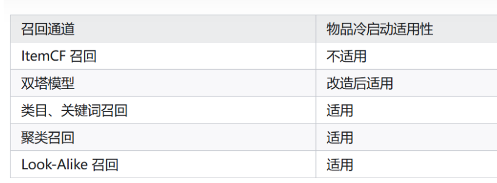
流量调控：比如让今天发布的item占比远大于1/30 新item提权保量 可以用提权系数动态地提权保量

### 81. 双塔模型优缺点，L2 norm的作用

双塔模型(Two-Tower Model)是一种用于推荐系统和信息检索的神经网络架构，特别适用于大规模检索场景。它包含两个并行的神经网络"塔"：

用户塔(User Tower): 处理用户特征（如人口统计信息、历史行为、兴趣偏好）
物品塔(Item Tower): 处理物品特征（如物品内容、类别、属性）

基本工作流程：

用户塔接收用户特征输入，经过多层神经网络处理，输出用户向量表示
物品塔接收物品特征输入，经过多层神经网络处理，输出物品向量表示
最后通过计算用户向量和物品向量之间的相似度（通常是内积或余弦相似度）来预测用户对物品的兴趣程度

双塔模型的优点：
高效的在线服务、可扩展性、延迟低、灵活、冷启动友好

双塔模型的缺点：
缺乏交叉特征建模、表现力受限、训练-服务不一致性、两个塔的分布不匹配

在双塔模型中，最后一层通常会进行L2归一化（即将向量转换为单位向量），有以下几个重要原因：
稳定性: 归一化可以防止向量范数变化过大，提高训练稳定性。
相似度度量一致性: 归一化后，内积等价于余弦相似度，使得相似度计算更直观，仅依赖向量方向而非大小。
防止长尾效应: 没有归一化的情况下，一些热门物品可能占据更大的向量空间，导致推荐多样性降低。
有效的近似最近邻搜索: 大多数向量检索库（如FAISS）对归一化向量的检索效率更高，精度更好。
温度缩放控制: 归一化配合温度参数使用，可以灵活控制推荐结果的多样性与准确性平衡。
解决梯度爆炸问题: 归一化可以防止梯度在训练过程中爆炸，特别是在使用大批量训练时。


## 排序

### 82. DIN模型 (Attention)

DIN模型是对LastN序列建模的的一种方法，使用加权平均代替平均，本质是注意力机制，权重即是候选物品与用户LastN物品的相似度。结果是一个向量，把向量作为一种用户特征输入排序模型，预估（用户，候选物品）的点击率、点赞率等指标。
DIN模型的缺点：只关注短期兴趣，遗忘长期兴趣
改进：SIM模型
1. 保留用户长期行为记录，n的大小可以是几千
2. 对于每个候选物品，在用户LastN记录中做快速查找，找到k个相似物品（Hard Search：根据候选物品的类目保留LastN物品中类目相同的， or Soft Search：对物品做embedding变成向量，将候选物品向量作为query做近似k近邻查找）
3. 把LastN变成topk，然后输入到注意力层
4. SIM模型实现了计算量的减小（从n到k）

### 83. 如果序列很长怎么办 (Positional Encoding)

positional encoding
self-attention

### 84. infoNCE (对比学习，常用于召回或精排辅助)

它的核心思想是通过最大化相似样本之间的互信息（Mutual Information），使得模型能够学习出更好的特征表示。
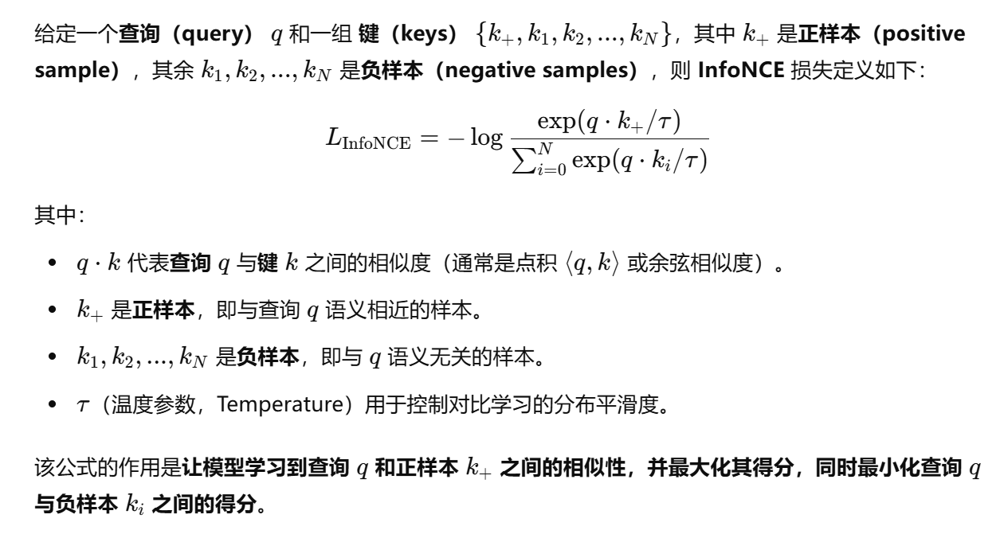

### 85. PLE和MMOE的区别 (多任务学习) 

PLE（Progressive Layered Extraction）和 MMOE（Multi-Gate Mixture-of-Experts）是两种常见的多任务学习（Multi-Task Learning, MTL）架构，主要用于推荐系统等应用场景。它们的核心思想是通过共享和个性化建模来提升多个任务的性能，但它们在结构设计和信息流动方式上有所不同。
1. MMOE（Multi-Gate Mixture-of-Experts）
MMOE（多门控专家混合模型）是一种改进的 Mixture-of-Experts（MoE）架构。其核心思想是：

通过多个**专家网络（Experts）**共享底层特征表示，避免任务间的负迁移。
由**多个门控网络（Gating Networks）**来动态调整不同任务的特征选择，使每个任务可以自适应地利用专家网络的输出。
MMOE 结构
输入层（Input Layer）：输入原始特征，如用户信息、物品信息等。
多个专家网络（Shared Experts）：通常是多个 MLP（多层感知机），所有任务共享这些专家。
多个门控网络（Gating Networks）：每个任务都有一个独立的门控网络，决定如何组合各个专家的输出。
任务塔（Task Towers）：每个任务都有自己的 MLP 进行最终预测。
MMOE 的优点
专家网络共享底层特征，避免直接对任务进行硬共享，提升泛化能力。
每个任务都有独立的门控网络，可以学习不同的专家组合方式，提高任务之间的信息交互能力。
比硬共享（Hard Parameter Sharing）更灵活，能够缓解任务间的竞争关系（负迁移问题）。
MMOE 的缺点
专家网络的利用率可能不均衡，部分专家可能被某些任务频繁调用，而其他专家可能被忽略。
任务间的共享仍然是隐式的，没有显式建模任务之间的关系，可能导致任务间的干扰。

2. PLE（Progressive Layered Extraction）
PLE（渐进式分层提取）是在 MMOE 的基础上改进的一种 MTL 方法，特别适用于任务相关性较复杂的场景。其核心思想是：

通过逐层特征提取（Progressive Extraction），让任务间的信息流动更加高效。
采用显式的任务特定专家（Task-Specific Experts）和共享专家（Shared Experts），进一步增强任务建模能力。
PLE 结构
PLE 采用了多层的架构，每层包含：

任务特定专家（Task-Specific Experts）：每个任务都有独立的专家网络，专门为该任务学习特征。
共享专家（Shared Experts）：所有任务共享的专家，捕捉多个任务的通用信息。
特征交互单元（Gate Networks）：负责任务间的信息传递，将上一层的信息输入到下一层，并控制特征的流动。
随着网络层数的增加，每一层的任务特定专家和共享专家会不断地进行信息交互，最终输入到每个任务的最终 MLP 进行预测。

PLE 的优点
任务间的信息交互更加精细，通过多层结构逐步提取特征，而不是像 MMOE 那样单次使用门控网络。
显式的任务特定专家和共享专家，比 MMOE 更有效地建模任务间的关系。
减少负迁移影响，每个任务的专家在保留个性化的同时仍能利用共享信息。
PLE 的缺点
结构更加复杂，计算成本更高，需要多个层级的特征提取。
超参数（层数、专家数、门控策略等）较多，需要更精细的调优。

### 86. MMOE (详解) 

MMOE（Multi-gate Mixture-of-Experts）和大模型中的MOE（Mixture-of-Experts）都是基于专家模型的架构，但它们在设计和应用上有所不同。

MMOE（Multi-gate Mixture-of-Experts）：

MMOE主要用于推荐系统中的多任务学习。在MMOE中，多个专家模型（Experts）共享相同的输入特征，并通过多个门控网络（Gates）来为不同的任务分配权重。每个门控网络负责为特定任务选择专家模型的输出，从而实现任务间的协同学习。这种设计使得MMOE能够有效地处理任务间的相关性和差异性。 
MMOE需要解决极化问题：对softmax的输出使用dropout：
softmax输出的n个数值被mask的概率都是10%
也就是说每个专家被随机丢弃的概率都是10%，使得每个任务只使用部分专家做预测，强迫每个专家都参与训练

MOE（Mixture-of-Experts）：

MOE是一种用于大规模模型的架构，旨在提高模型的容量和计算效率。在MOE中，多个专家模型根据输入数据的特征被激活，通常由一个门控网络来决定哪些专家模型参与计算。这种稀疏激活机制使得MOE能够在有限的计算资源下处理复杂任务。

### 87. 精排算法大总结 (FM, DeepFM, GBDT+LR, MLR, WDL, DCN, DIN, DIEN, BST, DSIN, SIM, BERT4Rec)


#### 1. FM与FFM (传统机器学习推荐模型)
FM为每个特征学习了一个隐向量，在特征交叉时，使用两个特征隐向量的内积作为特征交叉的权重。隐向量的引入使FM能够更好地解决数据稀疏性问题。FM虽然丢失某些特征组合的精确记忆能力。但是泛化能力大大提高。利用SGD随机梯度下降训练模型

相比FM模型，FFM通过引入特征域感知（field-aware）这一概念，把相同性质的特征归于同一field，使模型的表达能力更强。FM可以看成是FFM的特例，是把所有特征都归属到一个field中。

DeepFM：包含两部分：因子分解机部分与神经网络部分，分别负责低阶特征的提取和高阶特征的提取。这两部分共享同样的嵌入层输入。DeepFM的预测结果：
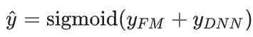
#### 2. GBDT+LR (传统机器学习推荐模型)
GBDT（Gradient Boosting Decision Tree，梯度提升决策树）是一种集成学习算法，属于Boosting家族。它通过多个决策树的组合来提升模型的预测能力，广泛应用于回归和分类任务。

GBDT 的核心特点
**Boosting** 机制：
采用梯度提升策略，每棵树都试图修正前面树的误差，提高整体预测能力。
决策树作为基模型：
通常使用CART决策树（Classification And Regression Tree）。
加权累加：每棵树的预测结果都会加权累加，最终输出一个综合预测值。
特征自动组合：
GBDT 可以自动挖掘特征之间的组合关系，这是它相比于逻辑回归（LR）的一大优势。
GBDT 在 GBDT+LR 中的作用
GBDT 负责自动学习特征组合，提高模型的特征表达能力。
LR 负责处理大规模稀疏特征，提升模型的可解释性和效率。
结合 GBDT 和 LR，可以既发挥 GBDT 的特征学习能力，又保持 LR 计算高效、适用于大规模数据的优点。
应用场景：
CTR（点击率）预测
风险控制
互联网广告推荐
搜索排序等
Facebook 在 2014 年提出 GBDT+LR 方案，成为多模型融合的经典方法之一。

- 为什么建树采用GBDT而非RF？

RF（随机森林）也是多棵树，但从效果上实践证明不如GBDT。GBDT前面的树，特征分裂主要体现对多数样本有区分度的特征；后面的树，主要体现的是经过前N棵树后，残差仍较大的少数样本。优先选择在整体上有区分度的特征，再选用少数针对少数样本有区分度的特征，更加符合特征选择思想。
#### 3. MLR 混合逻辑回归 阿里巴巴经典CTR预估模型 （传统机器学习）
MLR本质上是对线性LR模型的推广，利用分片线性方式对数据进行拟合，相比LR模型，能够学习到更高阶的特征组合。
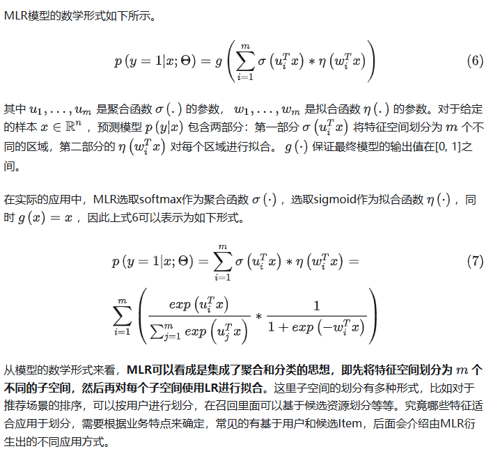
在推荐场景，广告位置靠前的，一般用户点击的概率越高，传统的LR模型一般是把位置信息作为特征加进去，而现在可以通过对MLR模型按bias特征做加权，让模型自动去学习每个位置的概率。乘法加权的方式比加法求和的方式影响更显著，使得位置特征的影响更容易被模型学习出来。在阿里巴巴的实际业务中，位置bias的引入，使得RPM提升4%。

#### 4.  WDL——Google经典CTR预估模型 （迈向深度学习）
Wide and Deep Learning for recommender systems
WDL模型中的Wide部分主要作用是让模型具有较强的记忆能力，Deep部分的主要作用是让模型具有泛化能力，这样的特点使得WDL能够兼容复杂的人工交叉特征，同时学习到更复杂的高阶交叉。Wide部分模型结构是LR，主要用于处理大量的人工交叉特征；Deep部分模型结构是神经网络，善于挖掘挖掘潜在的隐藏模式。最终，输出层将Wide部分和Deep部分组合起来，形成统一的输出。

#### 5. DCN——深度特征交叉网络
在WDL之后，有越来越多的工作集中于分别改进Wide部分和Deep部分。2017年，谷歌针对WDL的Wide部分进行改进，提出了Deep&Cross模型（简称DCN）。DCN模型的结构如图所示。其主要思路是使用Cross网络替代原来的Wide网络，以此提升模型的交叉能力。
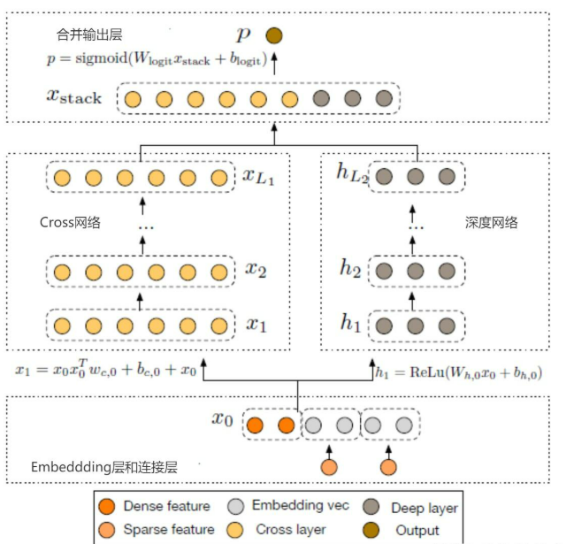
交叉层在保证特征交互的同时，尽量的降低模型的参数，每一层仅增加了n维的权重向量。由多层交叉层组成的DCN网络在WDL模型中wide部分的基础上进行特征的自动交叉组合，避免了更多依赖人工特征交叉。

#### 6. DIN 基于Attention的用户兴趣表达 （爱考）
在DIN之前，对于用户兴趣的表达就是直接把所有历史点击做sum pooling，使用sum pooing会导致所有历史行为都没有区分，实际上用户当前的兴趣应该只和历史上某些行为是关联的。
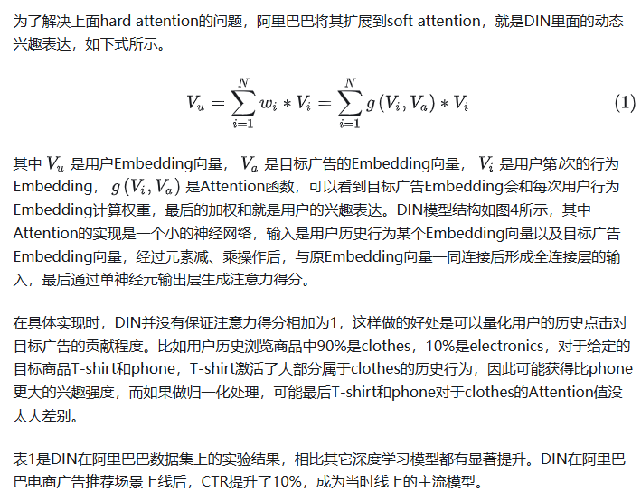
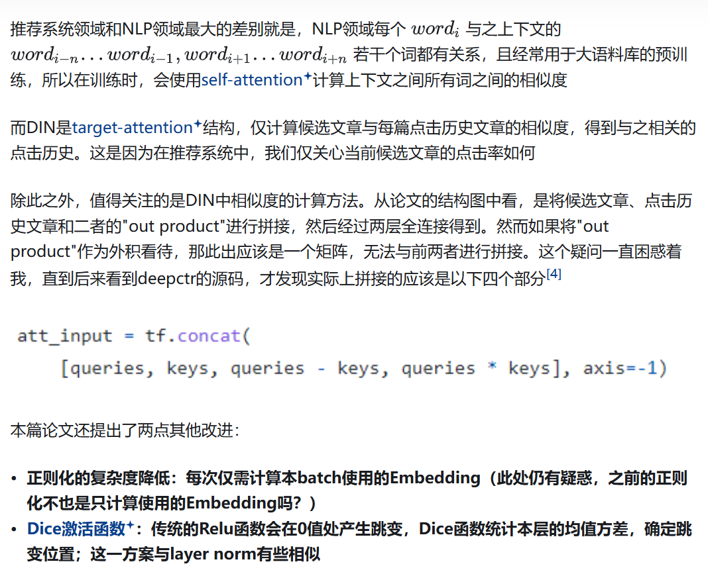

#### 7. DIEN 序列模型建模用户兴趣
DIEN的提出，就是为了解决前面DIN没有考虑序列信息的缺陷。
DIEN模型和图4中DIN模型架构相似，输入特征分别经过Embedding层、兴趣表达层、MLP层、输出层，最终得到CTR预估。区别在于兴趣表达不同，DIEN模型的创新在于构建了兴趣进化网络。
DIEN的兴趣进化网络分为三层，分别是行为序列层（Behavior Layer）、兴趣抽取层（Interest Extractor Layer）、兴趣演化层（Interest Evolving Layer）。
（1）行为序列层。其主要作用是把原始的用户行为序列id转换为Embedding。
（2）兴趣抽取层。其主要作用是通过序列模型模拟用户兴趣迁移，抽取用户兴趣。
（3）兴趣演化层。其主要作用是通过在兴趣抽取层基础上加入注意力机制，模拟与目标广告相关的兴趣演化过程。兴趣演化层是DIEN最重要的模块，也是最主要的创新点。

在兴趣进化网络中，行为序列层和普通的Embedding层没有区别，只是简单的把id类特征转化为Embedding，模拟用户兴趣迁移的主要是兴趣抽取层和兴趣演化层。

- 兴趣抽取层
  通过序列模型GRU（Gated Recurrent Unit，门控循环单元）处理序列特征，能够刻画行为序列之间的相关性。相比传统的序列模型RNN（Recurrent Nerual Network，循环神经网络），GRU解决了RNN梯度消失的问题。和LSTM（Long Short-Term Memory，长短记忆网络）相比，GRU的参数更少，训练收敛速度更快，因此GRU成为了DIEN序列模型的选择。
- 兴趣演化层
  为什么要设计兴趣演化层？ 用户兴趣的多样性可能发生兴趣漂移
  DIEN兴趣演化层相比兴趣抽取层最大的特点就是加入了注意力机制。DIEN在兴趣演化层实验了三种不同的引入注意力机制方法，分别是AIGRU（GRU with attention input）、AGRU（Attention based GRU）以及AUGRU（GRU with attention update gate）。

#### 8. BST 使用Transformer建模用户行为序列
本篇文章与DIN最大的不同是，BST使用了self-attention结构，在模型图中，除了候选文章与点击历史的相似度外，还需要计算点击历史之间的相似度。之所以由target-attention转变为self-attention这样做，作者提出的原因是，target-attention没有考虑到点击历史的顺序性。在文章最后，也对二者进行了比较，得出结论BST优于DIN.
BST的transformer layer与传统的transformer一样，首先进行multi-head self-attention与resnet+norm，之后再进行Feed Forward与resnet+norm
然而使用self-attention带来的最大的问题就是，时间复杂度提升明显。target-attention仅计算候选文章的相似度，时间复杂度仅为O(LD) self-attention需要计算每一个文章的相似度，时间复杂度变为O(L^2D)BST论文中详细记载了所选用的参数。可以发现BST仅使用了20条点击历史，这对于推荐系统来说并不算多，时间复杂度的提升可能就是一项重要因素
#### 9. DSIN 基于Session的兴趣演化模型
Session兴趣演化网络分为四层，从下至上分别是：

（1）Session划分层（Session Division Layer）。其主要作用是将用户的行为序列划分为不同Session。

（2）Session兴趣抽取层（Session Interest Extractor Layer）。其主要作用是通过Multi-head Self-attention模型生成Session Embedding。

（3）Session兴趣交互层（Session Interest Interacting Layer）。主要作用是通过模拟用户Session迁移过程，生成用户历史兴趣状态向量。

（4）Session兴趣激活层（Session Interest Activating Layer）。其主要作用是通过注意力机制获取用户历史Session兴趣和目标Item的相关性，生成和目标Item相关的Session兴趣表达。

#### 10. SIM——基于搜索的超长用户行为建模
阿里巴巴提出了“一人一世界”的全新建模理念，将每个用户的life-long行为数据构建成可以被高效检索的索引库，在做预估任务时将候选的item信息作为Query来对用户的历史行为库做搜索，获取和此item相关的信息来辅组预估。这样每个用户私有的行为索引库就类似大脑里面存储的记忆，任何一次预测就是访问记忆做决策的过程。模型被命名为Search-based User Interest Model（SIM），用于解决工业级应用大规模的用户行为建模的挑战。

（需要离线构建索引，存储开销显著增加）

SIM包含两级检索模块GSU（General Search Unit，通用搜索单元）和ESU（Extract Search Unit，精准搜索单元）。

在第一阶段，利用GSU从原始用户行为中搜索Top-K相关的用户子序列行为。这个搜索时间远低于原始行为遍历时间，同时K也比原始用户行为小几个数量级。GSU在限制的时间内采用了合适且有效的方案来对于超长用户行为进行搜索。GSU主要包含两种搜索方案，分别是soft-search 和 hard-search。GSU 将原始的用户行为从数万降低到数百，同时还过滤掉了和候选广告信息不相关的用户行为数据。

在第二阶段，ESU利用 GSU 产出的和广告相关的用户序列数据来捕捉用户跟广告更精准的兴趣表达。由于用户行为已经降低到数百量级，因此在这个部分SIM采用复杂的模型结构来进行建模。

#### 11. BERT4Rec
BERT4Rec是将BERT结构应用到推荐系统领域的经典论文。

推荐系统领域内的序列表示经常从NLP领域汲取经验，比如使用word2vec无监督训练点击序列，获得文章的embedding表示。将BERT引入到推荐系统中也是自然而然的事情。

BERT4Rec的模型结构与BERT完全相同，仅输入层去除了表示segmant embedding，这是由于BERT需要预测两序列是否存在上下句关系，而推荐系统无此需求

除此之外，BERT4Rec同样使用了MLM（masked language model），在训练时，随机对部分词进行mask作为预测值。

### 88. FTRL (在线学习)

FTRL（Follow-The-Regularized-Leader） 是一种在线学习（Online Learning） 和 稀疏优化 算法，常用于大规模机器学习任务，特别是广告推荐、点击率预估（CTR Prediction） 以及大规模线性模型优化。
FTRL 是一种在线梯度下降（Online Gradient Descent） 的改进算法。它结合了：
Follow-The-Leader（FTL）: 每次迭代都选择使过去所有损失最小的参数。
正则化（Regularization）: 通过 L1 和 L2 正则化，使参数更新更加稳定，并且能自动产生稀疏特征。
相比于普通的 SGD（随机梯度下降），FTRL 在处理高维稀疏数据时表现更优，尤其适用于CTR 预估、广告投放、搜索排序等任务。

### 89. youtubeDNN

YouTube DNN（YouTube Deep Neural Network） 是 YouTube 推荐系统 采用的深度学习模型，主要用于 大规模推荐任务，如视频推荐、广告推荐、个性化推荐等。
它在谷歌深度学习推荐系统（Google Deep Learning Recommender System）基础上，结合了Embedding 和 深度神经网络（DNN），用于学习用户兴趣，提供个性化推荐。

YouTube 推荐系统分为两个阶段：

1. 候选生成（Candidate Generation）
从百万级别的视频池中筛选出数百个候选视频。
通过**深度学习DNN**建模用户的观看行为，生成最相关的视频候选集。
2. 排序（Ranking）
对候选视频进行更细粒度的打分，重新排序。
结合用户特征、视频特征，优化最终的推荐列表。

YouTube DNN 主要用于 候选生成阶段，通过 Embedding + DNN 建模用户兴趣，高效生成推荐候选视频。
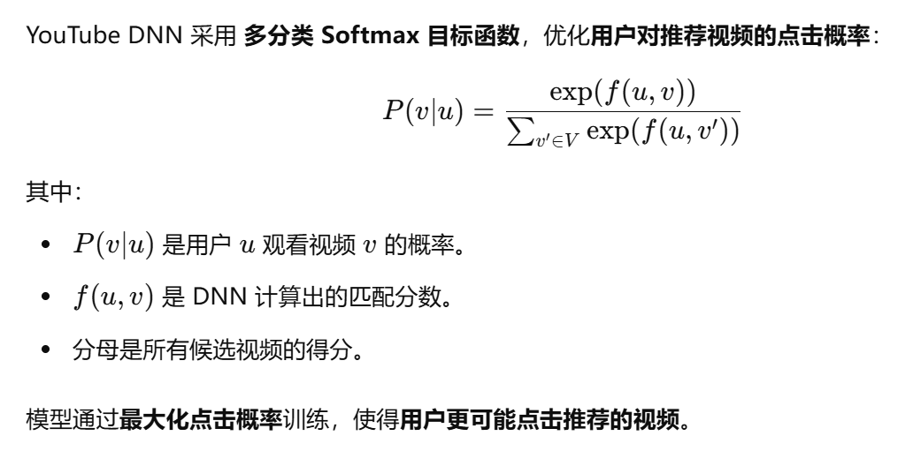


### 90. 精排部分的问题合集 (W&D特征选择, ESMM, 训练方式, 序列模型trick, Loss函数, 特征交叉模型SeNet/AutoInt/LHUC等)

#### 介绍一下wide&deep？ 哪些特征适合放在wide侧，哪些适合放在deep侧？用什么优化器？介绍一下FTRL？

#### ESMM？ESMM是解决什么问题的？什么情况适用ESSM？
ESMM（Entire Space Multi-task Model）损失 
ESMM 通过同时优化 CTR 和 CVR，并通过 联合建模 解决 CVR 样本选择偏差问题。
适用场景：适用于 点击-转化联合建模，防止 CVR 样本选择偏差

#### 实践中PLE如何训练？联合训练和交替训练两种方式适用于什么情况？各有什么优劣？
#### 对于多任务模型在实践中经常会遇到需要增加任务的情况，如何热启动？哪种方式效果好？
a. 完全冷启训练。这种适用于收敛较快，模型改动特别大的场景，尤其是对于sparse部分的修改。

b. 只热启sparse部分(embedding)。这是最常见的方式，一般增加目标的场景或者修改上层模型的场景下，sparse都是共享的，所以直接热启线上训练好的sparse表可以快速收敛，稳定性也更好。

c. 热启sparse部分和部分dense模型。比如只增加目标，不修改expert数量的场景下，直接热启expert专家模型的参数。这个在部分场景下适用，但不建议这样热启，因为当新增加一个任务或者修改上层模型后，整体的分布会改变，从之前的专家模型参数开始重新收敛并不一定比完全冷启expert专家模型效果更好，有可能会出现局部收敛陷阱，这个需要具体场景下的多组实验对比
#### 序列模型都有哪些？DIN在实践中有什么trick？ DIN模型有什么缺点？如何从特征角度和模型角度加以改善？DIN和Transformer对比的优劣？

#### DIEN？为什么实践中DIN更加常用？
DIN考虑了target item与用户行为序列中的item的交互，用target item得到item级别的权重对序列中的item进行加权，self attention只考虑了行为序列内部
#### CTR CVR损失函数
经典损失函数：二元交叉熵函数
适用于不均衡数据的损失函数：focal loss
AUC 目标优化损失：pairwise来优化AUC max（0，（y - y^ ））
适用于 CVR 预估的特殊损失：ESMM

#### 特征交叉模型
SeNet：不同特征不同权重
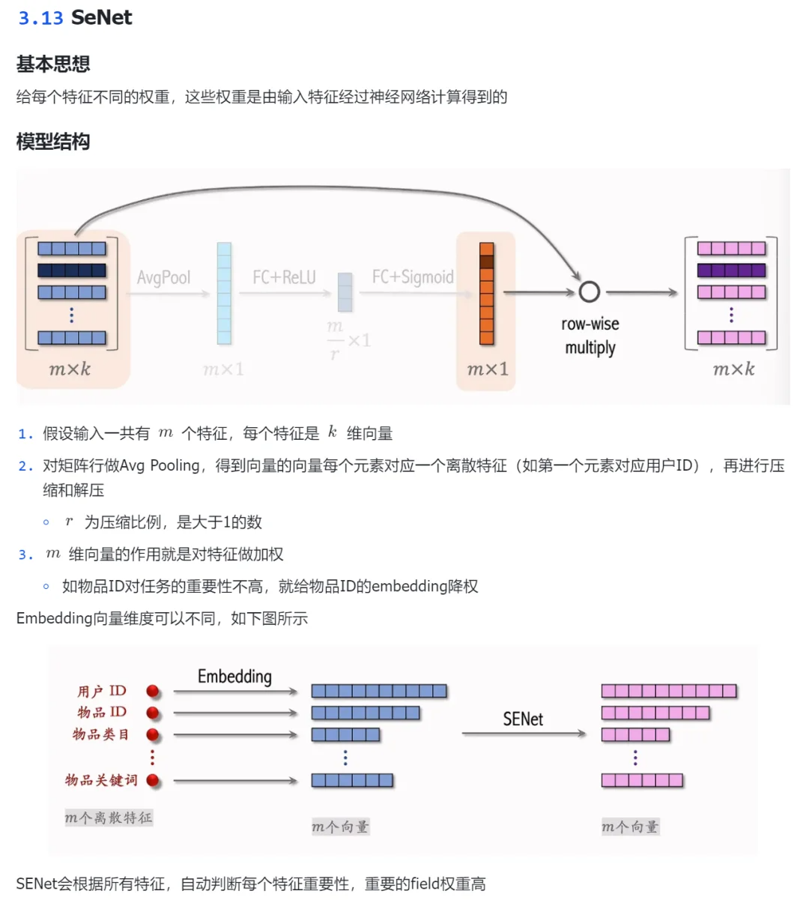
LHUC：不同类别特征交互得到权重
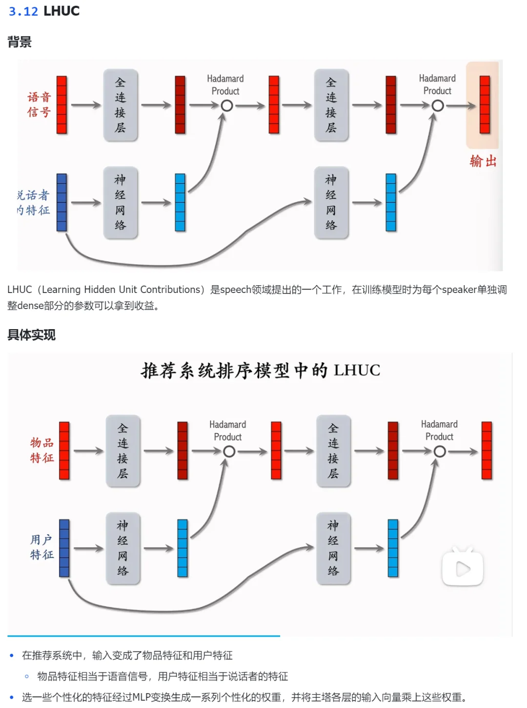
GateNet
AutoInt：注意力机制得到权重
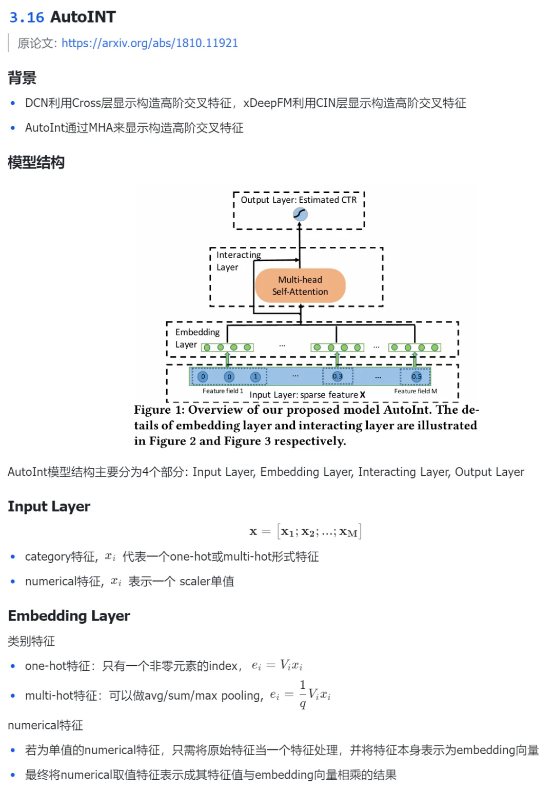
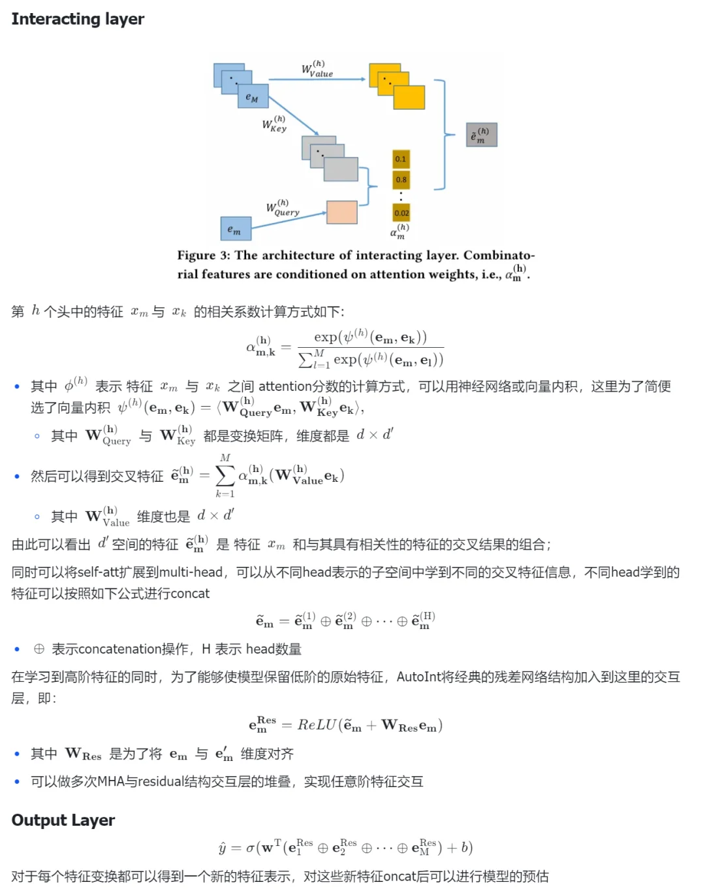
LHUC：
语音识别模型引用过来：

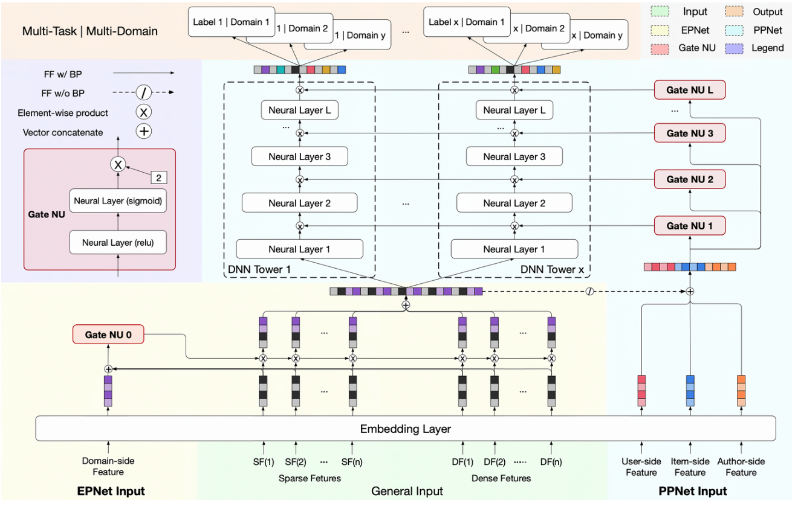
```
class PPNet(BaseModel):
    def __init__(self, 
                 feature_map, 
                 model_id="PPNet", 
                 gpu=-1, 
                 learning_rate=1e-3, 
                 embedding_dim=10,
                 gate_features=[],
                 gate_hidden_dim=64,
                 hidden_units=[64, 64, 64], 
                 hidden_activations="ReLU", 
                 net_dropout=0,
                 batch_norm=False,
                 embedding_regularizer=None, 
                 net_regularizer=None,
                 **kwargs):
        super(PPNet, self).__init__(feature_map, 
                                    model_id=model_id, 
                                    gpu=gpu, 
                                    embedding_regularizer=embedding_regularizer, 
                                    net_regularizer=net_regularizer,
                                    **kwargs)
        self.embedding_layer = FeatureEmbedding(feature_map, embedding_dim)
        self.gate_embed_layer = FeatureEmbedding(feature_map, embedding_dim, 
                                                 required_feature_columns=gate_features)
        gate_input_dim = feature_map.sum_emb_out_dim() + len(gate_features) * embedding_dim
        self.ppn = PPNetBlock(input_dim=feature_map.sum_emb_out_dim(),
                              output_dim=1,
                              gate_input_dim=gate_input_dim,
                              gate_hidden_dim=gate_hidden_dim,
                              hidden_units=hidden_units,
                              hidden_activations=hidden_activations,
                              dropout_rates=net_dropout,
                              batch_norm=batch_norm)
        self.compile(kwargs["optimizer"], kwargs["loss"], learning_rate)
        self.reset_parameters()
        self.model_to_device()
            
    def forward(self, inputs):
        X = self.get_inputs(inputs)
        feature_emb = self.embedding_layer(X)
        gate_emb = self.gate_embed_layer(X)
        y_pred = self.ppn(feature_emb.flatten(start_dim=1), 
                          gate_emb.flatten(start_dim=1))
        y_pred = self.output_activation(y_pred)
        return_dict = {"y_pred": y_pred}
        return return_dict
```


